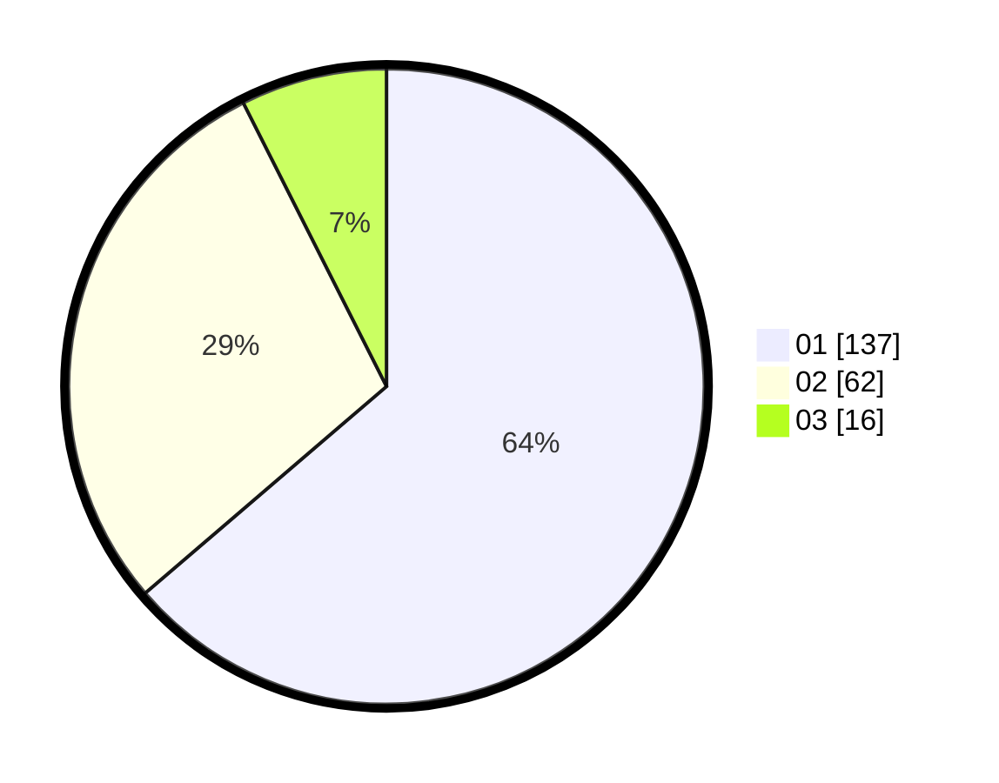

# Hasil

Hasil perolehan suara paslon dapat dilihat pada file paslon-01.txt, paslon-02.txt, dan paslon-03.txt.

Jika tidak ada, artinya data tersebut belum ada pada SIREKAP.

## Perolehan Suara

 * Paslon 01: **137**.
 * Paslon 02: **62**.
 * Paslon 03: **16**.

## Foto C Plano

https://sirekap-obj-formc.kpu.go.id/0d53/pemilu/ppwp/31/71/08/10/02/3171081002005-20240214-160134--c2e47d8c-cfee-4420-a78b-1e833075ca68.jpg

https://sirekap-obj-formc.kpu.go.id/0d53/pemilu/ppwp/31/71/08/10/02/3171081002005-20240214-155036--17595ea2-6bb5-442a-aa65-a88b38b1ef30.jpg

https://sirekap-obj-formc.kpu.go.id/0d53/pemilu/ppwp/31/71/08/10/02/3171081002005-20240214-155544--fbdc16eb-15a8-4bb7-a69e-95f021f2b4ad.jpg

## DATA PEMILIH TETAP

Jumlah pemilih dalam DPT: **287**.
 * L: **142**.
 * P: **145**.

## DATA PENGGUNA HAK PILIH

Jumlah pengguna hak pilih dalam DPT: **287**.
 * L: **142**.
 * P: **145**.

Jumlah pengguna hak pilih dalam DPTb: **0**.
 * L: **0**.
 * P: **0**.

Jumlah pengguna hak pilih dalam DPK: **1**.
 * L: **1**.
 * P: **0**.

Jumlah pengguna hak pilih: **222**.
 * L: **109**.
 * P: **113**.

## JUMLAH SUARA SAH DAN TIDAK SAH

JUMLAH SELURUH SUARA SAH: **215**.

JUMLAH SUARA TIDAK SAH: **7**.

JUMLAH SELURUH SUARA SAH DAN SUARA TIDAK SAH: **222**.
