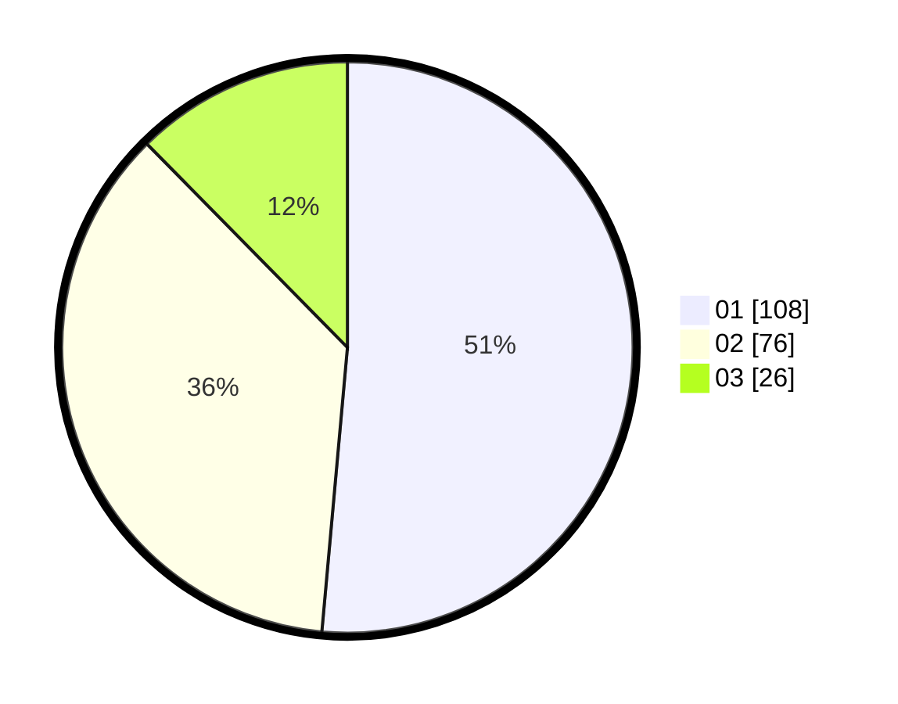

# Hasil

Hasil perolehan suara paslon dapat dilihat pada file paslon-01.txt, paslon-02.txt, dan paslon-03.txt.

Jika tidak ada, artinya data tersebut belum ada pada SIREKAP.

## Perolehan Suara

 * Paslon 01: **108**.
 * Paslon 02: **76**.
 * Paslon 03: **26**.

## Foto C Plano

https://sirekap-obj-formc.kpu.go.id/18dd/pemilu/ppwp/31/71/08/10/02/3171081002006-20240216-150015--b0bf80f9-5c7e-47f9-8f32-8b45ea04cac1.jpg

https://sirekap-obj-formc.kpu.go.id/18dd/pemilu/ppwp/31/71/08/10/02/3171081002006-20240216-150017--c06996e1-d15b-46c2-a477-cf72d506fda5.jpg

https://sirekap-obj-formc.kpu.go.id/18dd/pemilu/ppwp/31/71/08/10/02/3171081002006-20240216-150016--6b2acc78-7147-424e-bbe0-581fc9ce91b5.jpg

## DATA PEMILIH TETAP

Jumlah pemilih dalam DPT: **286**.
 * L: **149**.
 * P: **137**.

## DATA PENGGUNA HAK PILIH

Jumlah pengguna hak pilih dalam DPT: **210**.
 * L: **109**.
 * P: **101**.

Jumlah pengguna hak pilih dalam DPTb: **0**.
 * L: **0**.
 * P: **0**.

Jumlah pengguna hak pilih dalam DPK: **1**.
 * L: **1**.
 * P: **0**.

Jumlah pengguna hak pilih: **211**.
 * L: **110**.
 * P: **101**.

## JUMLAH SUARA SAH DAN TIDAK SAH

JUMLAH SELURUH SUARA SAH: **210**.

JUMLAH SUARA TIDAK SAH: **1**.

JUMLAH SELURUH SUARA SAH DAN SUARA TIDAK SAH: **211**.
