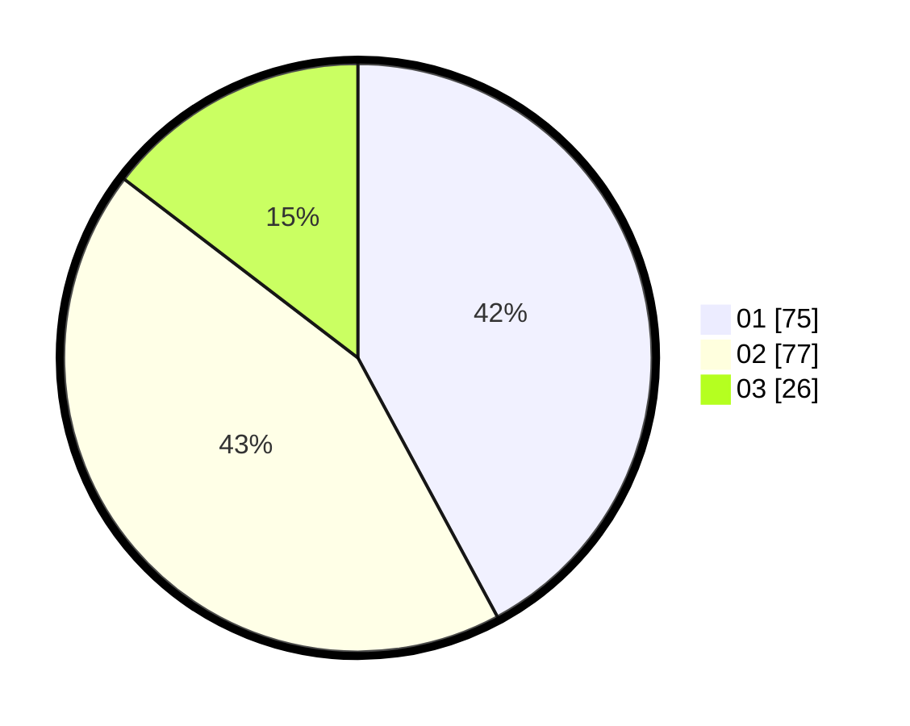

# Hasil

Hasil perolehan suara paslon dapat dilihat pada file paslon-01.txt, paslon-02.txt, dan paslon-03.txt.

Jika tidak ada, artinya data tersebut belum ada pada SIREKAP.

## Perolehan Suara

 * Paslon 01: **75**.
 * Paslon 02: **77**.
 * Paslon 03: **26**.

## Foto C Plano

https://sirekap-obj-formc.kpu.go.id/5427/pemilu/ppwp/31/71/08/10/02/3171081002007-20240216-145452--31c5f7aa-4f48-451c-8ce3-88c4698ec49a.jpg

https://sirekap-obj-formc.kpu.go.id/5427/pemilu/ppwp/31/71/08/10/02/3171081002007-20240216-145453--5d63a7d6-70f8-4efc-bbeb-335b3d3694e8.jpg

https://sirekap-obj-formc.kpu.go.id/5427/pemilu/ppwp/31/71/08/10/02/3171081002007-20240216-145453--6661753a-66ab-444a-9949-283b25092af4.jpg

## DATA PEMILIH TETAP

Jumlah pemilih dalam DPT: **277**.
 * L: **140**.
 * P: **137**.

## DATA PENGGUNA HAK PILIH

Jumlah pengguna hak pilih dalam DPT: **181**.
 * L: **85**.
 * P: **96**.

Jumlah pengguna hak pilih dalam DPTb: **0**.
 * L: **0**.
 * P: **0**.

Jumlah pengguna hak pilih dalam DPK: **0**.
 * L: **1**.
 * P: **0**.

Jumlah pengguna hak pilih: **181**.
 * L: **86**.
 * P: **96**.

## JUMLAH SUARA SAH DAN TIDAK SAH

JUMLAH SELURUH SUARA SAH: **178**.

JUMLAH SUARA TIDAK SAH: **3**.

JUMLAH SELURUH SUARA SAH DAN SUARA TIDAK SAH: **181**.
