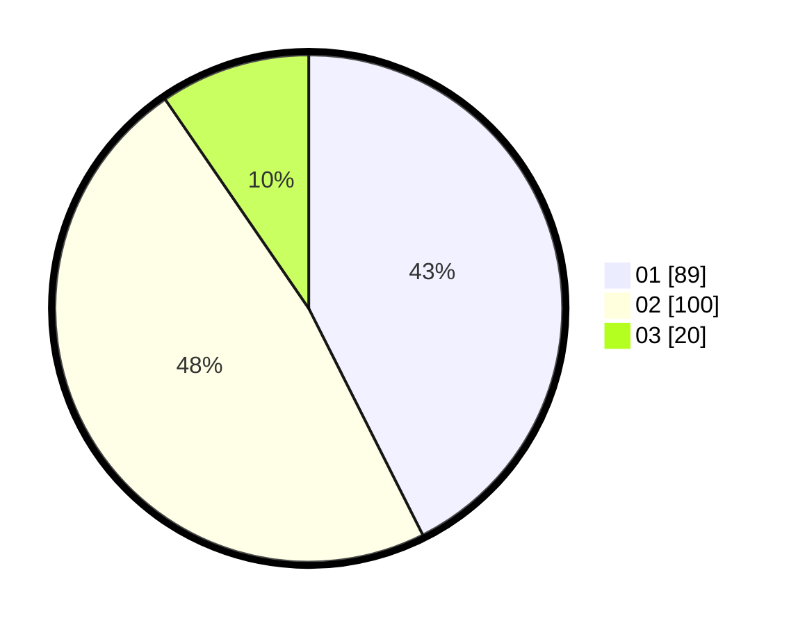

# Hasil

Hasil perolehan suara paslon dapat dilihat pada file paslon-01.txt, paslon-02.txt, dan paslon-03.txt.

Jika tidak ada, artinya data tersebut belum ada pada SIREKAP.

## Perolehan Suara

 * Paslon 01: **89**.
 * Paslon 02: **100**.
 * Paslon 03: **20**.

## Foto C Plano

https://sirekap-obj-formc.kpu.go.id/51a6/pemilu/ppwp/31/71/08/10/02/3171081002012-20240217-002757--839d5e60-357d-4802-b91f-2b710c215b6a.jpg

https://sirekap-obj-formc.kpu.go.id/51a6/pemilu/ppwp/31/71/08/10/02/3171081002012-20240217-002758--63a87fd2-74fe-4ab0-b050-069804facd7e.jpg

https://sirekap-obj-formc.kpu.go.id/51a6/pemilu/ppwp/31/71/08/10/02/3171081002012-20240217-002757--cab08250-2931-44ff-aefb-9f0112419805.jpg

## DATA PEMILIH TETAP

Jumlah pemilih dalam DPT: **0**.
 * L: **0**.
 * P: **0**.

## DATA PENGGUNA HAK PILIH

Jumlah pengguna hak pilih dalam DPT: **0**.
 * L: **0**.
 * P: **0**.

Jumlah pengguna hak pilih dalam DPTb: **0**.
 * L: **0**.
 * P: **0**.

Jumlah pengguna hak pilih dalam DPK: **0**.
 * L: **0**.
 * P: **0**.

Jumlah pengguna hak pilih: **0**.
 * L: **0**.
 * P: **0**.

## JUMLAH SUARA SAH DAN TIDAK SAH

JUMLAH SELURUH SUARA SAH: **209**.

JUMLAH SUARA TIDAK SAH: **3**.

JUMLAH SELURUH SUARA SAH DAN SUARA TIDAK SAH: **212**.
