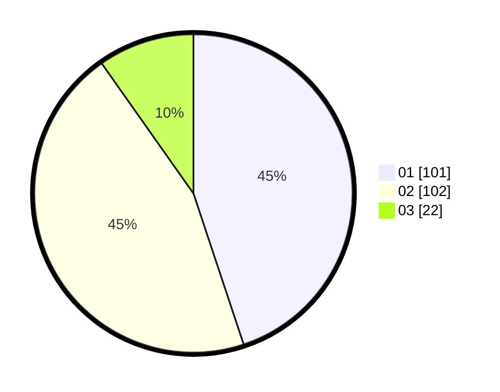

# Hasil

Hasil perolehan suara paslon dapat dilihat pada file paslon-01.txt, paslon-02.txt, dan paslon-03.txt.

Jika tidak ada, artinya data tersebut belum ada pada SIREKAP.

## Perolehan Suara

 * Paslon 01: **101**.
 * Paslon 02: **102**.
 * Paslon 03: **22**.

## Foto C Plano

https://sirekap-obj-formc.kpu.go.id/c6e1/pemilu/ppwp/31/71/08/10/02/3171081002014-20240216-074210--99a091c0-3a29-4194-a582-0e83b7f59521.jpg

https://sirekap-obj-formc.kpu.go.id/c6e1/pemilu/ppwp/31/71/08/10/02/3171081002014-20240216-074212--d6daa536-00dd-47aa-8f58-dd8447bb3102.jpg

https://sirekap-obj-formc.kpu.go.id/c6e1/pemilu/ppwp/31/71/08/10/02/3171081002014-20240216-074211--cac9964e-0e5e-4d6f-b652-b27331d3922a.jpg

## DATA PEMILIH TETAP

Jumlah pemilih dalam DPT: **280**.
 * L: **145**.
 * P: **135**.

## DATA PENGGUNA HAK PILIH

Jumlah pengguna hak pilih dalam DPT: **223**.
 * L: **109**.
 * P: **114**.

Jumlah pengguna hak pilih dalam DPTb: **4**.
 * L: **0**.
 * P: **4**.

Jumlah pengguna hak pilih dalam DPK: **0**.
 * L: **0**.
 * P: **0**.

Jumlah pengguna hak pilih: **227**.
 * L: **109**.
 * P: **118**.

## JUMLAH SUARA SAH DAN TIDAK SAH

JUMLAH SELURUH SUARA SAH: **225**.

JUMLAH SUARA TIDAK SAH: **2**.

JUMLAH SELURUH SUARA SAH DAN SUARA TIDAK SAH: **227**.
