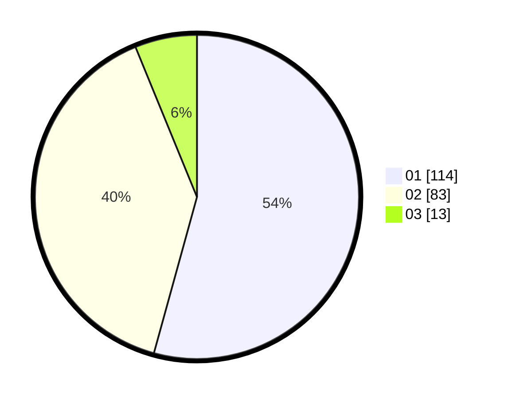

# Hasil

Hasil perolehan suara paslon dapat dilihat pada file paslon-01.txt, paslon-02.txt, dan paslon-03.txt.

Jika tidak ada, artinya data tersebut belum ada pada SIREKAP.

## Perolehan Suara

 * Paslon 01: **114**.
 * Paslon 02: **83**.
 * Paslon 03: **13**.

## Foto C Plano

https://sirekap-obj-formc.kpu.go.id/03b2/pemilu/ppwp/31/71/08/10/02/3171081002015-20240216-151703--537a8cc2-b496-4a80-8bdf-64c991114048.jpg

https://sirekap-obj-formc.kpu.go.id/03b2/pemilu/ppwp/31/71/08/10/02/3171081002015-20240216-151705--f6a2f10c-cead-450d-982c-8e0d67b357e0.jpg

https://sirekap-obj-formc.kpu.go.id/03b2/pemilu/ppwp/31/71/08/10/02/3171081002015-20240216-151704--025fec15-c473-40f0-bd3c-9e4fd015f266.jpg

## DATA PEMILIH TETAP

Jumlah pemilih dalam DPT: **269**.
 * L: **141**.
 * P: **128**.

## DATA PENGGUNA HAK PILIH

Jumlah pengguna hak pilih dalam DPT: **212**.
 * L: **107**.
 * P: **105**.

Jumlah pengguna hak pilih dalam DPTb: **0**.
 * L: **0**.
 * P: **0**.

Jumlah pengguna hak pilih dalam DPK: **1**.
 * L: **0**.
 * P: **1**.

Jumlah pengguna hak pilih: **213**.
 * L: **107**.
 * P: **106**.

## JUMLAH SUARA SAH DAN TIDAK SAH

JUMLAH SELURUH SUARA SAH: **210**.

JUMLAH SUARA TIDAK SAH: **3**.

JUMLAH SELURUH SUARA SAH DAN SUARA TIDAK SAH: **213**.
