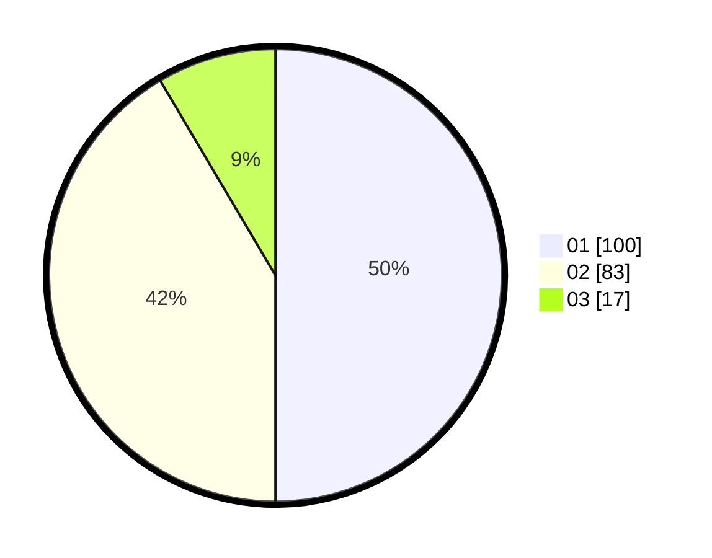

# Hasil

Hasil perolehan suara paslon dapat dilihat pada file paslon-01.txt, paslon-02.txt, dan paslon-03.txt.

Jika tidak ada, artinya data tersebut belum ada pada SIREKAP.

## Perolehan Suara

 * Paslon 01: **100**.
 * Paslon 02: **83**.
 * Paslon 03: **17**.

## Foto C Plano

https://sirekap-obj-formc.kpu.go.id/f7d8/pemilu/ppwp/31/71/08/10/02/3171081002018-20240214-221828--6596683b-26c7-4994-89fd-a5cc788d979d.jpg

https://sirekap-obj-formc.kpu.go.id/f7d8/pemilu/ppwp/31/71/08/10/02/3171081002018-20240214-202539--70216c20-b342-4105-8e13-cbe1cc36faa9.jpg

https://sirekap-obj-formc.kpu.go.id/f7d8/pemilu/ppwp/31/71/08/10/02/3171081002018-20240214-193710--a4650afc-c63f-448a-9305-ef45f915fd76.jpg

## DATA PEMILIH TETAP

Jumlah pemilih dalam DPT: **266**.
 * L: **141**.
 * P: **125**.

## DATA PENGGUNA HAK PILIH

Jumlah pengguna hak pilih dalam DPT: **202**.
 * L: **105**.
 * P: **97**.

Jumlah pengguna hak pilih dalam DPTb: **0**.
 * L: **0**.
 * P: **0**.

Jumlah pengguna hak pilih dalam DPK: **1**.
 * L: **0**.
 * P: **1**.

Jumlah pengguna hak pilih: **203**.
 * L: **105**.
 * P: **98**.

## JUMLAH SUARA SAH DAN TIDAK SAH

JUMLAH SELURUH SUARA SAH: **200**.

JUMLAH SUARA TIDAK SAH: **3**.

JUMLAH SELURUH SUARA SAH DAN SUARA TIDAK SAH: **203**.
