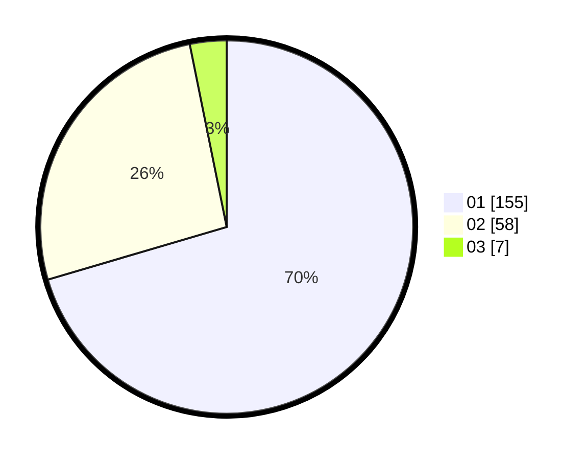

# Hasil

Hasil perolehan suara paslon dapat dilihat pada file paslon-01.txt, paslon-02.txt, dan paslon-03.txt.

Jika tidak ada, artinya data tersebut belum ada pada SIREKAP.

## Perolehan Suara

 * Paslon 01: **155**.
 * Paslon 02: **58**.
 * Paslon 03: **7**.

## Foto C Plano

https://sirekap-obj-formc.kpu.go.id/476f/pemilu/ppwp/31/71/08/10/02/3171081002020-20240214-155651--4d019cc8-885d-4a18-b087-3ba7b329eb25.jpg

https://sirekap-obj-formc.kpu.go.id/476f/pemilu/ppwp/31/71/08/10/02/3171081002020-20240214-155900--8b2931c4-2a6f-4d06-bec1-c89077a9f988.jpg

https://sirekap-obj-formc.kpu.go.id/476f/pemilu/ppwp/31/71/08/10/02/3171081002020-20240216-150451--ba8fde56-7759-4ae7-b69f-ec9f5b7f9092.jpg

## DATA PEMILIH TETAP

Jumlah pemilih dalam DPT: **281**.
 * L: **149**.
 * P: **132**.

## DATA PENGGUNA HAK PILIH

Jumlah pengguna hak pilih dalam DPT: **226**.
 * L: **116**.
 * P: **110**.

Jumlah pengguna hak pilih dalam DPTb: **0**.
 * L: **0**.
 * P: **0**.

Jumlah pengguna hak pilih dalam DPK: **0**.
 * L: **0**.
 * P: **0**.

Jumlah pengguna hak pilih: **226**.
 * L: **116**.
 * P: **110**.

## JUMLAH SUARA SAH DAN TIDAK SAH

JUMLAH SELURUH SUARA SAH: **220**.

JUMLAH SUARA TIDAK SAH: **6**.

JUMLAH SELURUH SUARA SAH DAN SUARA TIDAK SAH: **226**.
