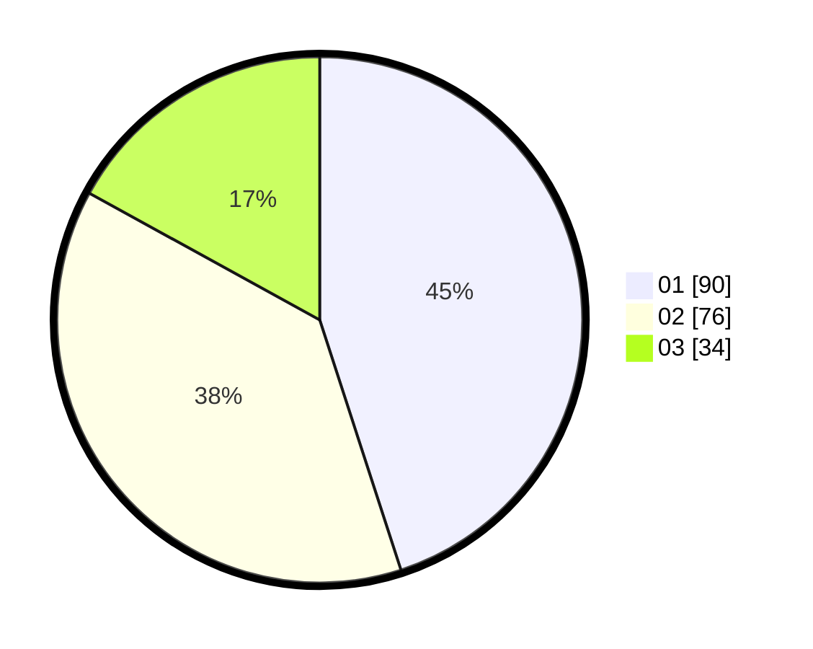

# Hasil

Hasil perolehan suara paslon dapat dilihat pada file paslon-01.txt, paslon-02.txt, dan paslon-03.txt.

Jika tidak ada, artinya data tersebut belum ada pada SIREKAP.

## Perolehan Suara

 * Paslon 01: **90**.
 * Paslon 02: **76**.
 * Paslon 03: **34**.

## Foto C Plano

https://sirekap-obj-formc.kpu.go.id/1868/pemilu/ppwp/31/71/08/10/02/3171081002022-20240215-011953--a665dbf4-3654-41fa-a6d8-90bead5cea1f.jpg

https://sirekap-obj-formc.kpu.go.id/1868/pemilu/ppwp/31/71/08/10/02/3171081002022-20240215-012136--f3325433-9403-46bf-9ea0-bf55b04d24f5.jpg

https://sirekap-obj-formc.kpu.go.id/1868/pemilu/ppwp/31/71/08/10/02/3171081002022-20240215-012322--f8e8dd06-2069-4637-8550-bf067561f258.jpg
