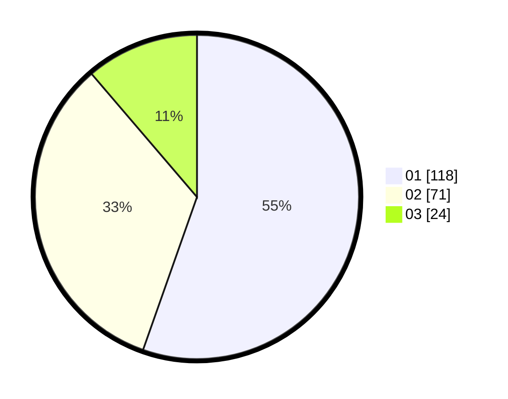

# Hasil

Hasil perolehan suara paslon dapat dilihat pada file paslon-01.txt, paslon-02.txt, dan paslon-03.txt.

Jika tidak ada, artinya data tersebut belum ada pada SIREKAP.

## Perolehan Suara

 * Paslon 01: **118**.
 * Paslon 02: **71**.
 * Paslon 03: **24**.

## Foto C Plano

https://sirekap-obj-formc.kpu.go.id/0d85/pemilu/ppwp/31/71/08/10/02/3171081002024-20240214-190949--787a779a-83a8-404c-ad94-6631e91419a6.jpg

https://sirekap-obj-formc.kpu.go.id/0d85/pemilu/ppwp/31/71/08/10/02/3171081002024-20240214-190951--9dd2725c-de71-4b1b-adf9-6f788ca19dd8.jpg

https://sirekap-obj-formc.kpu.go.id/0d85/pemilu/ppwp/31/71/08/10/02/3171081002024-20240216-152614--ef73bcaf-dd29-4c92-84e8-32539c5e5393.jpg

## DATA PEMILIH TETAP

Jumlah pemilih dalam DPT: **271**.
 * L: **142**.
 * P: **129**.

## DATA PENGGUNA HAK PILIH

Jumlah pengguna hak pilih dalam DPT: **206**.
 * L: **100**.
 * P: **106**.

Jumlah pengguna hak pilih dalam DPTb: **8**.
 * L: **5**.
 * P: **3**.

Jumlah pengguna hak pilih dalam DPK: **1**.
 * L: **1**.
 * P: **0**.

Jumlah pengguna hak pilih: **215**.
 * L: **106**.
 * P: **109**.

## JUMLAH SUARA SAH DAN TIDAK SAH

JUMLAH SELURUH SUARA SAH: **213**.

JUMLAH SUARA TIDAK SAH: **2**.

JUMLAH SELURUH SUARA SAH DAN SUARA TIDAK SAH: **215**.
