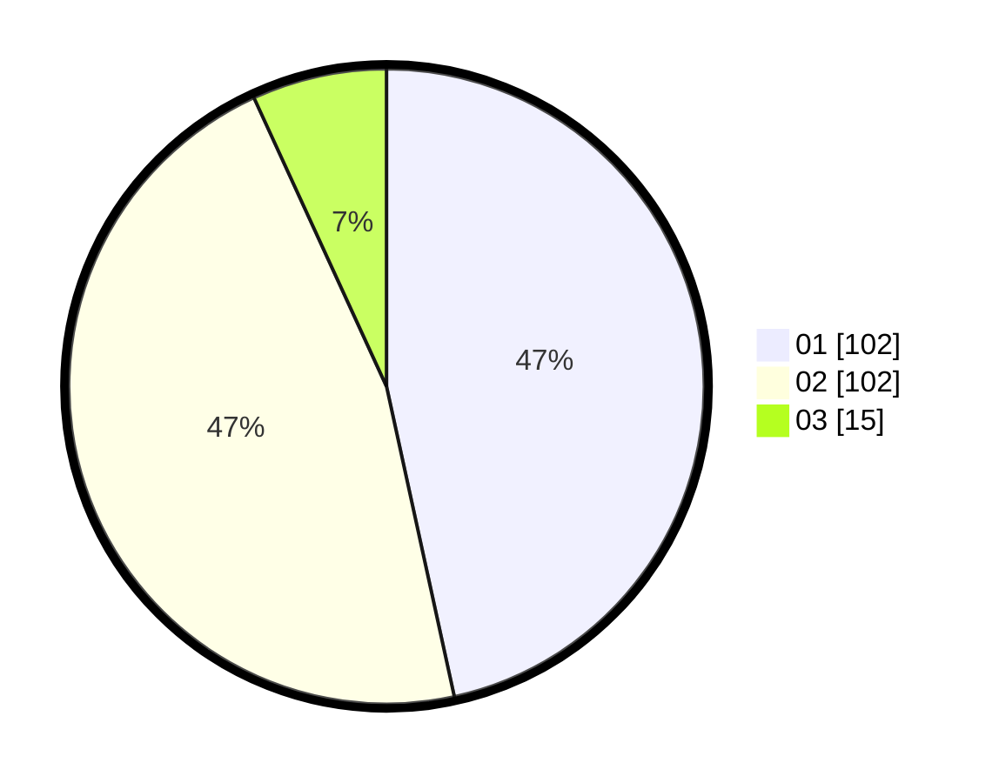

# Hasil

Hasil perolehan suara paslon dapat dilihat pada file paslon-01.txt, paslon-02.txt, dan paslon-03.txt.

Jika tidak ada, artinya data tersebut belum ada pada SIREKAP.

## Perolehan Suara

 * Paslon 01: **102**.
 * Paslon 02: **102**.
 * Paslon 03: **15**.

## Foto C Plano

https://sirekap-obj-formc.kpu.go.id/18e8/pemilu/ppwp/31/71/08/10/02/3171081002025-20240216-102912--81dc9d69-f532-4d00-95e1-6196b7f3410c.jpg

https://sirekap-obj-formc.kpu.go.id/18e8/pemilu/ppwp/31/71/08/10/02/3171081002025-20240216-102932--8afad991-7d48-4ad6-b704-d9365745bffc.jpg

https://sirekap-obj-formc.kpu.go.id/18e8/pemilu/ppwp/31/71/08/10/02/3171081002025-20240216-103225--757ec506-c953-4a23-9e00-39735ec9219d.jpg

## DATA PEMILIH TETAP

Jumlah pemilih dalam DPT: **282**.
 * L: **154**.
 * P: **128**.

## DATA PENGGUNA HAK PILIH

Jumlah pengguna hak pilih dalam DPT: **223**.
 * L: **117**.
 * P: **106**.

Jumlah pengguna hak pilih dalam DPTb: **2**.
 * L: **2**.
 * P: **0**.

Jumlah pengguna hak pilih dalam DPK: **1**.
 * L: **0**.
 * P: **1**.

Jumlah pengguna hak pilih: **226**.
 * L: **119**.
 * P: **107**.

## JUMLAH SUARA SAH DAN TIDAK SAH

JUMLAH SELURUH SUARA SAH: **219**.

JUMLAH SUARA TIDAK SAH: **7**.

JUMLAH SELURUH SUARA SAH DAN SUARA TIDAK SAH: **226**.
