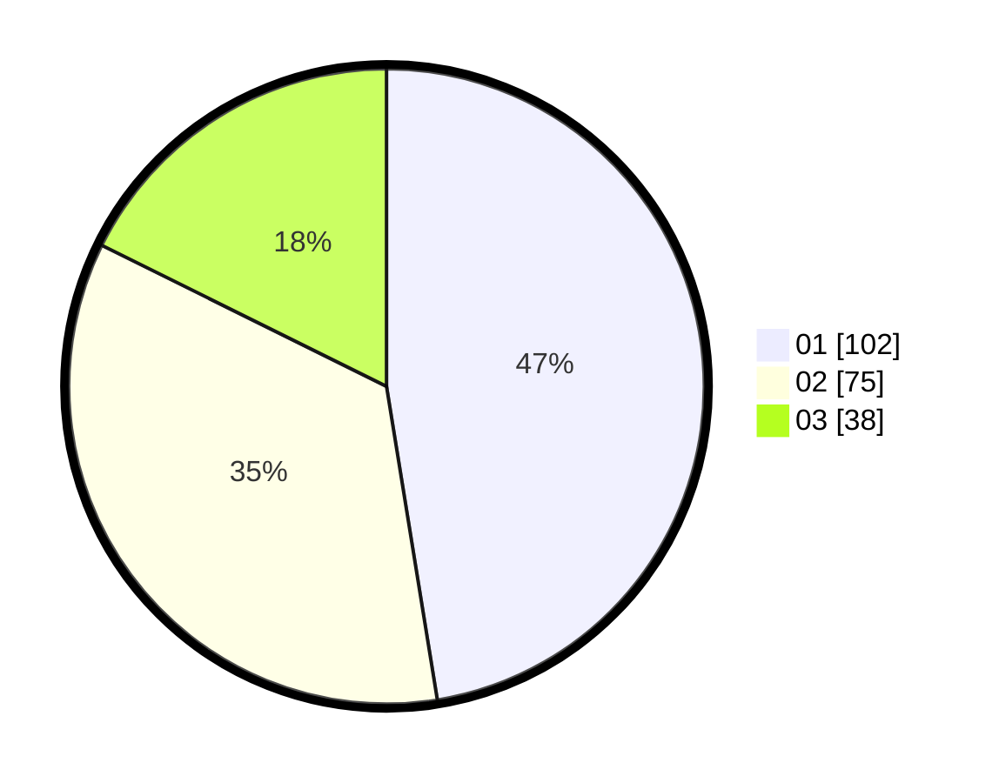

# Hasil

Hasil perolehan suara paslon dapat dilihat pada file paslon-01.txt, paslon-02.txt, dan paslon-03.txt.

Jika tidak ada, artinya data tersebut belum ada pada SIREKAP.

## Perolehan Suara

 * Paslon 01: **102**.
 * Paslon 02: **75**.
 * Paslon 03: **38**.

## Foto C Plano

https://sirekap-obj-formc.kpu.go.id/d428/pemilu/ppwp/31/71/08/10/02/3171081002027-20240215-130548--037edb41-560f-408f-bfe7-98d68e891ead.jpg

https://sirekap-obj-formc.kpu.go.id/d428/pemilu/ppwp/31/71/08/10/02/3171081002027-20240214-160127--ca4eb635-ef42-4258-b280-ca5bc4865290.jpg

https://sirekap-obj-formc.kpu.go.id/d428/pemilu/ppwp/31/71/08/10/02/3171081002027-20240216-005621--63aedf02-410a-49ff-add4-19c07781842a.jpg

## DATA PEMILIH TETAP

Jumlah pemilih dalam DPT: **278**.
 * L: **137**.
 * P: **141**.

## DATA PENGGUNA HAK PILIH

Jumlah pengguna hak pilih dalam DPT: **211**.
 * L: **99**.
 * P: **112**.

Jumlah pengguna hak pilih dalam DPTb: **2**.
 * L: **2**.
 * P: **0**.

Jumlah pengguna hak pilih dalam DPK: **3**.
 * L: **2**.
 * P: **1**.

Jumlah pengguna hak pilih: **216**.
 * L: **103**.
 * P: **113**.

## JUMLAH SUARA SAH DAN TIDAK SAH

JUMLAH SELURUH SUARA SAH: **215**.

JUMLAH SUARA TIDAK SAH: **1**.

JUMLAH SELURUH SUARA SAH DAN SUARA TIDAK SAH: **216**.
