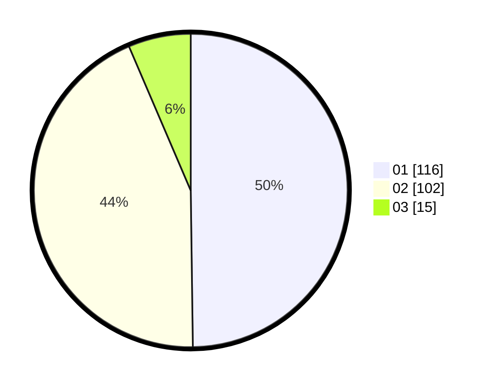

# Hasil

Hasil perolehan suara paslon dapat dilihat pada file paslon-01.txt, paslon-02.txt, dan paslon-03.txt.

Jika tidak ada, artinya data tersebut belum ada pada SIREKAP.

## Perolehan Suara

 * Paslon 01: **116**.
 * Paslon 02: **102**.
 * Paslon 03: **15**.

## Foto C Plano

https://sirekap-obj-formc.kpu.go.id/0686/pemilu/ppwp/31/71/08/10/02/3171081002035-20240217-063032--abb1629d-e64f-4780-9ac5-bc16520e3ea9.jpg

https://sirekap-obj-formc.kpu.go.id/0686/pemilu/ppwp/31/71/08/10/02/3171081002035-20240217-062311--c97debe2-f375-48dd-87a3-6db6c9e3cbe5.jpg

https://sirekap-obj-formc.kpu.go.id/0686/pemilu/ppwp/31/71/08/10/02/3171081002035-20240214-193112--04022a3b-53b5-4165-a9d1-cd3bfb4e78b7.jpg

## DATA PEMILIH TETAP

Jumlah pemilih dalam DPT: **282**.
 * L: **152**.
 * P: **130**.

## DATA PENGGUNA HAK PILIH

Jumlah pengguna hak pilih dalam DPT: **228**.
 * L: **119**.
 * P: **109**.

Jumlah pengguna hak pilih dalam DPTb: **6**.
 * L: **3**.
 * P: **3**.

Jumlah pengguna hak pilih dalam DPK: **3**.
 * L: **1**.
 * P: **2**.

Jumlah pengguna hak pilih: **237**.
 * L: **123**.
 * P: **114**.

## JUMLAH SUARA SAH DAN TIDAK SAH

JUMLAH SELURUH SUARA SAH: **233**.

JUMLAH SUARA TIDAK SAH: **4**.

JUMLAH SELURUH SUARA SAH DAN SUARA TIDAK SAH: **237**.
