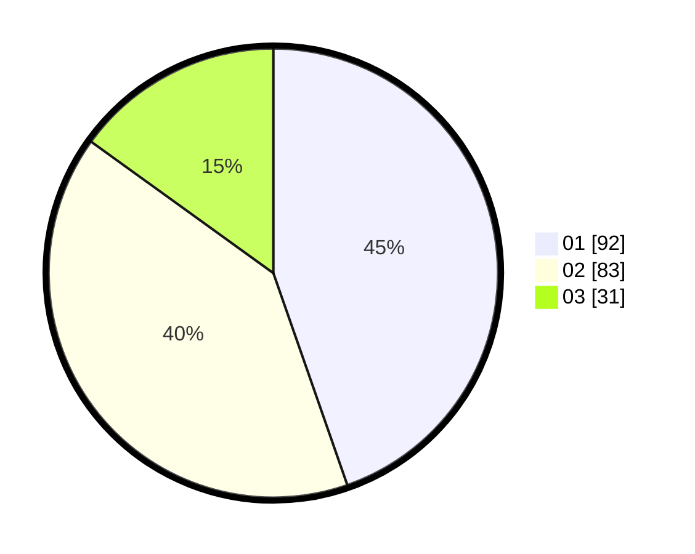

# Hasil

Hasil perolehan suara paslon dapat dilihat pada file paslon-01.txt, paslon-02.txt, dan paslon-03.txt.

Jika tidak ada, artinya data tersebut belum ada pada SIREKAP.

## Perolehan Suara

 * Paslon 01: **92**.
 * Paslon 02: **83**.
 * Paslon 03: **31**.

## Foto C Plano

https://sirekap-obj-formc.kpu.go.id/c5cf/pemilu/ppwp/31/71/08/10/02/3171081002038-20240214-210420--384cf47f-d4ed-4c7c-9ab4-27a15c92c9f9.jpg

https://sirekap-obj-formc.kpu.go.id/c5cf/pemilu/ppwp/31/71/08/10/02/3171081002038-20240214-210621--c077c646-39ae-4826-9097-fbaca7800f7d.jpg

https://sirekap-obj-formc.kpu.go.id/c5cf/pemilu/ppwp/31/71/08/10/02/3171081002038-20240214-221655--f773fccf-c563-4433-8658-a04090d41e2f.jpg

## DATA PEMILIH TETAP

Jumlah pemilih dalam DPT: **274**.
 * L: **126**.
 * P: **148**.

## DATA PENGGUNA HAK PILIH

Jumlah pengguna hak pilih dalam DPT: **208**.
 * L: **92**.
 * P: **116**.

Jumlah pengguna hak pilih dalam DPTb: **9**.
 * L: **6**.
 * P: **3**.

Jumlah pengguna hak pilih dalam DPK: **2**.
 * L: **1**.
 * P: **1**.

Jumlah pengguna hak pilih: **219**.
 * L: **99**.
 * P: **120**.

## JUMLAH SUARA SAH DAN TIDAK SAH

JUMLAH SELURUH SUARA SAH: **206**.

JUMLAH SUARA TIDAK SAH: **13**.

JUMLAH SELURUH SUARA SAH DAN SUARA TIDAK SAH: **219**.
