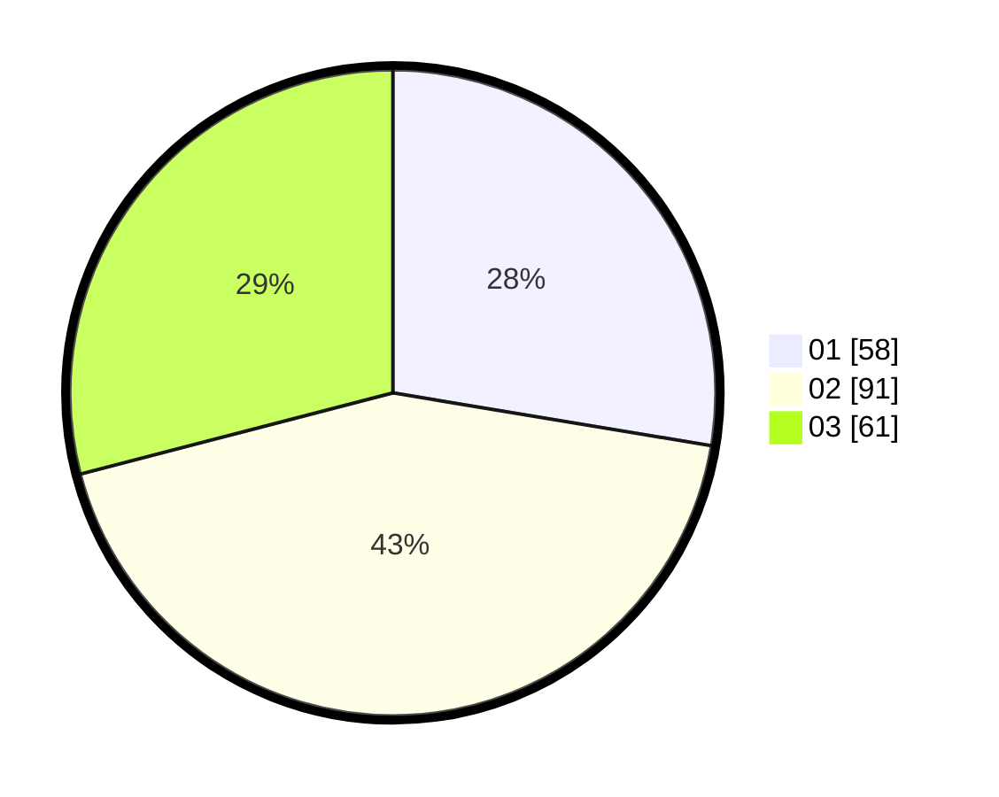

# Hasil

Hasil perolehan suara paslon dapat dilihat pada file paslon-01.txt, paslon-02.txt, dan paslon-03.txt.

Jika tidak ada, artinya data tersebut belum ada pada SIREKAP.

## Perolehan Suara

 * Paslon 01: **58**.
 * Paslon 02: **91**.
 * Paslon 03: **61**.

## Foto C Plano

https://sirekap-obj-formc.kpu.go.id/b34b/pemilu/ppwp/31/71/08/10/02/3171081002039-20240214-222825--814ac86c-8a17-4a10-8f56-93178642a6af.jpg

https://sirekap-obj-formc.kpu.go.id/b34b/pemilu/ppwp/31/71/08/10/02/3171081002039-20240214-220425--f9d75873-a762-4a17-b5a8-0cfa511a5a4e.jpg

https://sirekap-obj-formc.kpu.go.id/b34b/pemilu/ppwp/31/71/08/10/02/3171081002039-20240214-220614--db5f9da2-8b88-47c8-97d1-d08bc5a7f4df.jpg
