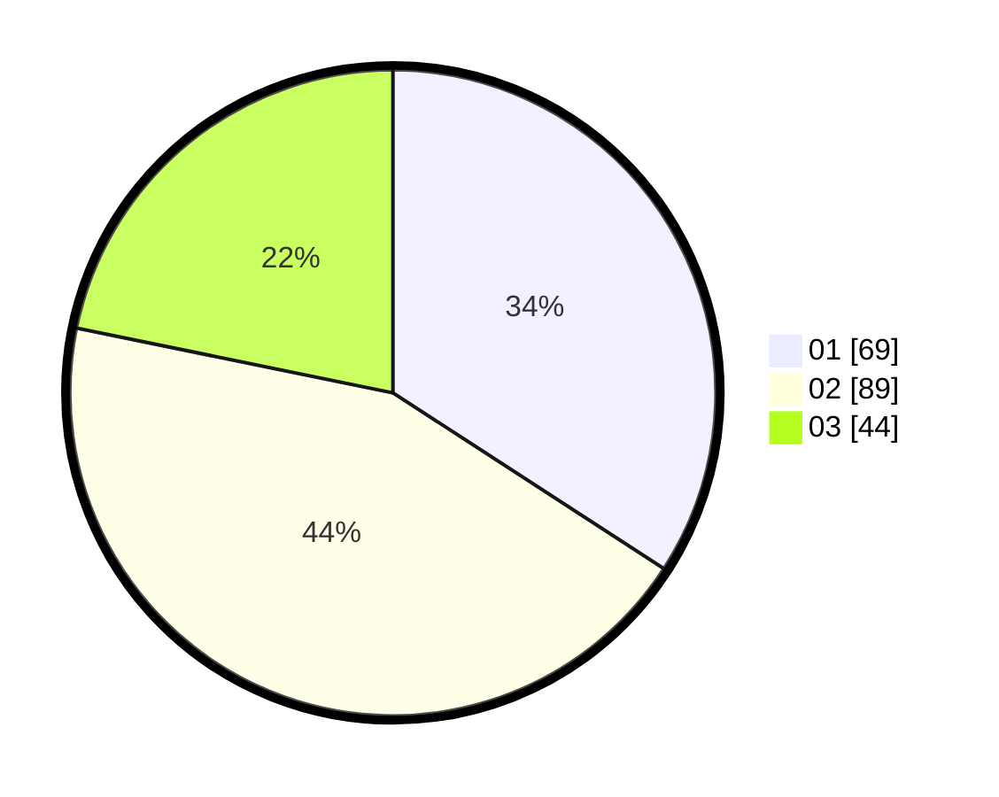

# Hasil

Hasil perolehan suara paslon dapat dilihat pada file paslon-01.txt, paslon-02.txt, dan paslon-03.txt.

Jika tidak ada, artinya data tersebut belum ada pada SIREKAP.

## Perolehan Suara

 * Paslon 01: **69**.
 * Paslon 02: **89**.
 * Paslon 03: **44**.

## Foto C Plano

https://sirekap-obj-formc.kpu.go.id/23e0/pemilu/ppwp/31/71/08/10/02/3171081002047-20240214-221658--a563b84d-ccb6-4b50-b884-50bd730f6955.jpg

https://sirekap-obj-formc.kpu.go.id/23e0/pemilu/ppwp/31/71/08/10/02/3171081002047-20240214-222125--82aea8b1-0aa0-425a-b4a9-25a14c0d4924.jpg

https://sirekap-obj-formc.kpu.go.id/23e0/pemilu/ppwp/31/71/08/10/02/3171081002047-20240214-222244--c2d02671-2a53-4921-a249-2bc5b05f1723.jpg
