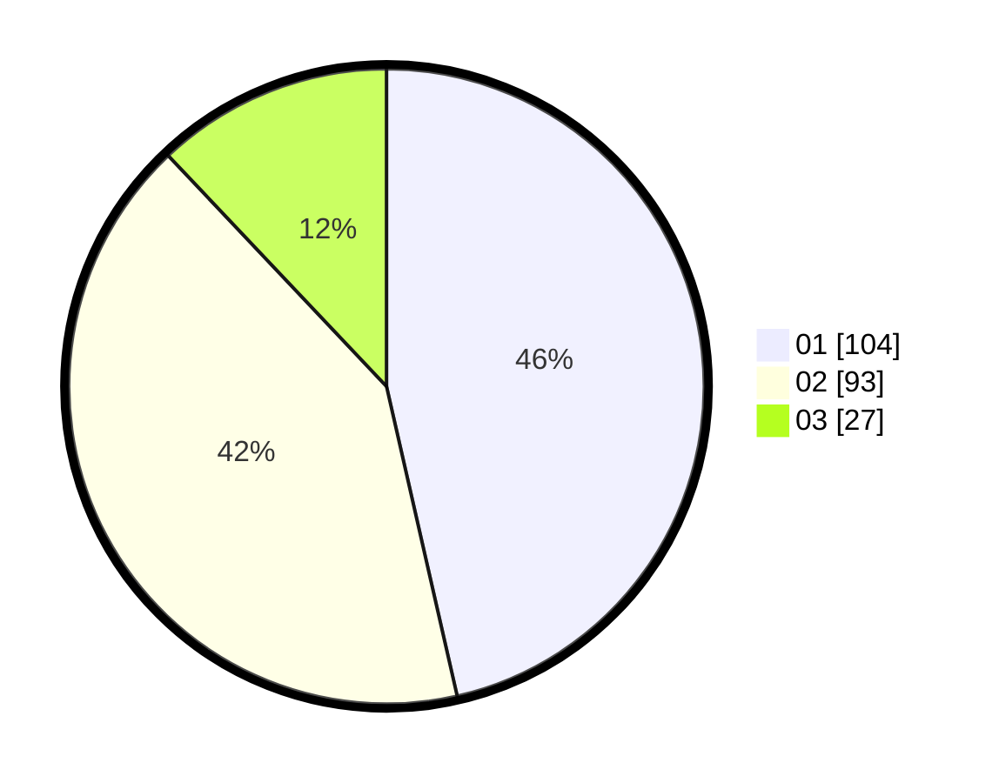

# Hasil

Hasil perolehan suara paslon dapat dilihat pada file paslon-01.txt, paslon-02.txt, dan paslon-03.txt.

Jika tidak ada, artinya data tersebut belum ada pada SIREKAP.

## Perolehan Suara

 * Paslon 01: **104**.
 * Paslon 02: **93**.
 * Paslon 03: **27**.

## Foto C Plano

https://sirekap-obj-formc.kpu.go.id/8d5c/pemilu/ppwp/31/71/08/10/02/3171081002054-20240215-014909--b559c4cb-c906-4df8-b72d-dd3d8d1b1a20.jpg

https://sirekap-obj-formc.kpu.go.id/8d5c/pemilu/ppwp/31/71/08/10/02/3171081002054-20240215-010631--8afd10c5-e5c3-475c-9d52-533449734160.jpg

https://sirekap-obj-formc.kpu.go.id/8d5c/pemilu/ppwp/31/71/08/10/02/3171081002054-20240215-010840--23a5a814-2f0f-466d-81b6-ed323cae1995.jpg
