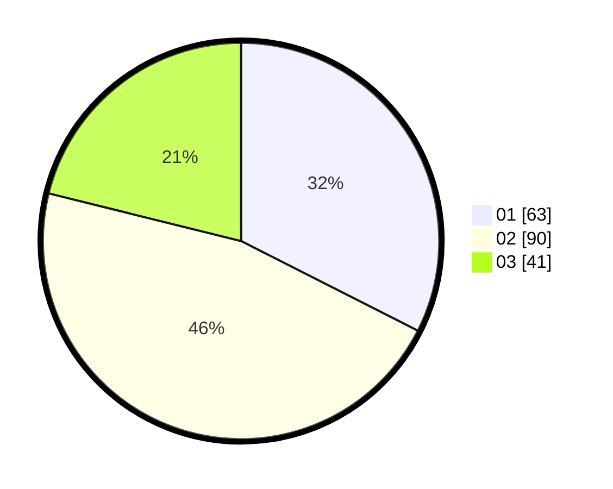

# Hasil

Hasil perolehan suara paslon dapat dilihat pada file paslon-01.txt, paslon-02.txt, dan paslon-03.txt.

Jika tidak ada, artinya data tersebut belum ada pada SIREKAP.

## Perolehan Suara

 * Paslon 01: **63**.
 * Paslon 02: **90**.
 * Paslon 03: **41**.

## Foto C Plano

https://sirekap-obj-formc.kpu.go.id/13ac/pemilu/ppwp/31/71/08/10/02/3171081002055-20240216-150155--fd40de5d-09ac-4c1c-ab39-e60e9b0e9444.jpg

https://sirekap-obj-formc.kpu.go.id/13ac/pemilu/ppwp/31/71/08/10/02/3171081002055-20240216-150157--520cd443-bb94-4b20-8de4-78ab79bd9f2f.jpg

https://sirekap-obj-formc.kpu.go.id/13ac/pemilu/ppwp/31/71/08/10/02/3171081002055-20240216-150156--5c61d0c4-acd4-41a1-8cb6-0f08769b6e09.jpg

## DATA PEMILIH TETAP

Jumlah pemilih dalam DPT: **270**.
 * L: **139**.
 * P: **131**.

## DATA PENGGUNA HAK PILIH

Jumlah pengguna hak pilih dalam DPT: **194**.
 * L: **94**.
 * P: **100**.

Jumlah pengguna hak pilih dalam DPTb: **0**.
 * L: **0**.
 * P: **0**.

Jumlah pengguna hak pilih dalam DPK: **4**.
 * L: **2**.
 * P: **2**.

Jumlah pengguna hak pilih: **198**.
 * L: **96**.
 * P: **102**.

## JUMLAH SUARA SAH DAN TIDAK SAH

JUMLAH SELURUH SUARA SAH: **194**.

JUMLAH SUARA TIDAK SAH: **4**.

JUMLAH SELURUH SUARA SAH DAN SUARA TIDAK SAH: **198**.
