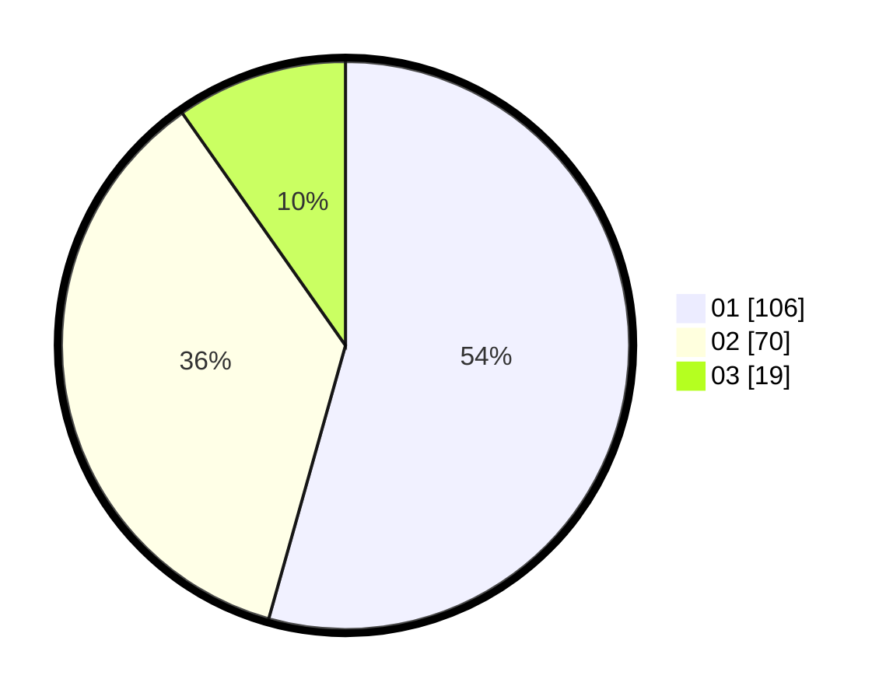

# Hasil

Hasil perolehan suara paslon dapat dilihat pada file paslon-01.txt, paslon-02.txt, dan paslon-03.txt.

Jika tidak ada, artinya data tersebut belum ada pada SIREKAP.

## Perolehan Suara

 * Paslon 01: **106**.
 * Paslon 02: **70**.
 * Paslon 03: **19**.

## Foto C Plano

https://sirekap-obj-formc.kpu.go.id/f5c2/pemilu/ppwp/31/71/08/10/02/3171081002056-20240216-152643--df225462-445a-47fd-99a4-ac359ebceb23.jpg

https://sirekap-obj-formc.kpu.go.id/f5c2/pemilu/ppwp/31/71/08/10/02/3171081002056-20240216-152644--016630d9-b161-4afd-94f0-0d9d0eed69b7.jpg

https://sirekap-obj-formc.kpu.go.id/f5c2/pemilu/ppwp/31/71/08/10/02/3171081002056-20240216-152644--977bfd56-c484-4bf6-9761-c3b0e34090ca.jpg

## DATA PEMILIH TETAP

Jumlah pemilih dalam DPT: **250**.
 * L: **127**.
 * P: **123**.

## DATA PENGGUNA HAK PILIH

Jumlah pengguna hak pilih dalam DPT: **183**.
 * L: **91**.
 * P: **92**.

Jumlah pengguna hak pilih dalam DPTb: **10**.
 * L: **6**.
 * P: **4**.

Jumlah pengguna hak pilih dalam DPK: **4**.
 * L: **1**.
 * P: **3**.

Jumlah pengguna hak pilih: **197**.
 * L: **98**.
 * P: **99**.

## JUMLAH SUARA SAH DAN TIDAK SAH

JUMLAH SELURUH SUARA SAH: **195**.

JUMLAH SUARA TIDAK SAH: **2**.

JUMLAH SELURUH SUARA SAH DAN SUARA TIDAK SAH: **197**.
