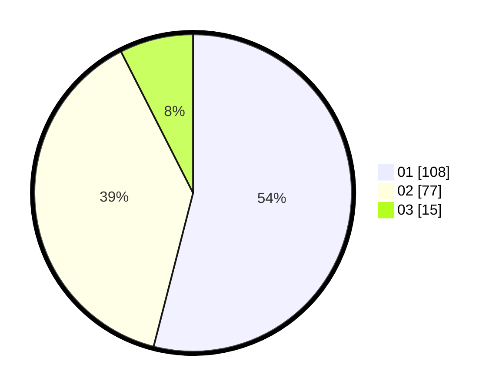

# Hasil

Hasil perolehan suara paslon dapat dilihat pada file paslon-01.txt, paslon-02.txt, dan paslon-03.txt.

Jika tidak ada, artinya data tersebut belum ada pada SIREKAP.

## Perolehan Suara

 * Paslon 01: **108**.
 * Paslon 02: **77**.
 * Paslon 03: **15**.

## Foto C Plano

https://sirekap-obj-formc.kpu.go.id/a7c3/pemilu/ppwp/31/71/08/10/02/3171081002057-20240215-033924--9ec2e0df-59c4-44f5-9f93-c5dadb45376e.jpg

https://sirekap-obj-formc.kpu.go.id/a7c3/pemilu/ppwp/31/71/08/10/02/3171081002057-20240215-034313--8c40de30-0e7e-4eed-9d38-68748cb1df3c.jpg

https://sirekap-obj-formc.kpu.go.id/a7c3/pemilu/ppwp/31/71/08/10/02/3171081002057-20240215-034527--38a85082-9d10-4eaa-b38c-34487ff020b9.jpg
