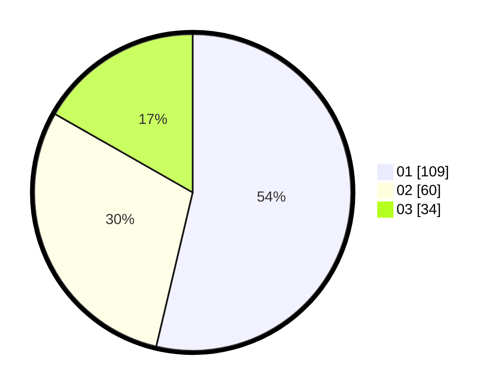

# Hasil

Hasil perolehan suara paslon dapat dilihat pada file paslon-01.txt, paslon-02.txt, dan paslon-03.txt.

Jika tidak ada, artinya data tersebut belum ada pada SIREKAP.

## Perolehan Suara

 * Paslon 01: **109**.
 * Paslon 02: **60**.
 * Paslon 03: **34**.

## Foto C Plano

https://sirekap-obj-formc.kpu.go.id/073f/pemilu/ppwp/31/71/08/10/02/3171081002060-20240216-141557--ae6565cf-95f4-4330-8eda-3ae2a7c40a20.jpg

https://sirekap-obj-formc.kpu.go.id/073f/pemilu/ppwp/31/71/08/10/02/3171081002060-20240216-131813--3d1217dc-b3bd-4f1f-a4b5-370f1257853b.jpg

https://sirekap-obj-formc.kpu.go.id/073f/pemilu/ppwp/31/71/08/10/02/3171081002060-20240216-141558--29e1d0e9-4c2e-4923-9571-4ed2cbe1942a.jpg

## DATA PEMILIH TETAP

Jumlah pemilih dalam DPT: **256**.
 * L: **113**.
 * P: **143**.

## DATA PENGGUNA HAK PILIH

Jumlah pengguna hak pilih dalam DPT: **202**.
 * L: **90**.
 * P: **112**.

Jumlah pengguna hak pilih dalam DPTb: **0**.
 * L: **0**.
 * P: **0**.

Jumlah pengguna hak pilih dalam DPK: **4**.
 * L: **3**.
 * P: **1**.

Jumlah pengguna hak pilih: **206**.
 * L: **93**.
 * P: **113**.

## JUMLAH SUARA SAH DAN TIDAK SAH

JUMLAH SELURUH SUARA SAH: **203**.

JUMLAH SUARA TIDAK SAH: **3**.

JUMLAH SELURUH SUARA SAH DAN SUARA TIDAK SAH: **206**.
