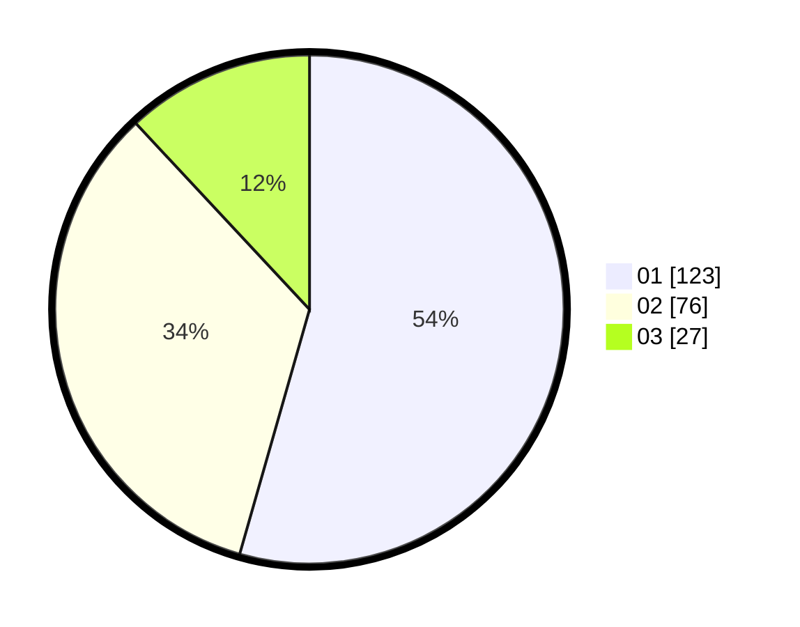

# Hasil

Hasil perolehan suara paslon dapat dilihat pada file paslon-01.txt, paslon-02.txt, dan paslon-03.txt.

Jika tidak ada, artinya data tersebut belum ada pada SIREKAP.

## Perolehan Suara

 * Paslon 01: **123**.
 * Paslon 02: **76**.
 * Paslon 03: **27**.

## Foto C Plano

https://sirekap-obj-formc.kpu.go.id/ac1c/pemilu/ppwp/31/71/08/10/02/3171081002063-20240216-210358--647268fe-5266-425d-9808-2ca20a98e7f0.jpg

https://sirekap-obj-formc.kpu.go.id/ac1c/pemilu/ppwp/31/71/08/10/02/3171081002063-20240216-210359--89b0da06-7531-479a-8f8f-eae0b8c841d4.jpg

https://sirekap-obj-formc.kpu.go.id/ac1c/pemilu/ppwp/31/71/08/10/02/3171081002063-20240216-210358--186a54c7-e29f-479e-a48f-88d091c1ea9c.jpg

## DATA PEMILIH TETAP

Jumlah pemilih dalam DPT: **270**.
 * L: **129**.
 * P: **141**.

## DATA PENGGUNA HAK PILIH

Jumlah pengguna hak pilih dalam DPT: **225**.
 * L: **111**.
 * P: **114**.

Jumlah pengguna hak pilih dalam DPTb: **0**.
 * L: **1**.
 * P: **0**.

Jumlah pengguna hak pilih dalam DPK: **2**.
 * L: **1**.
 * P: **1**.

Jumlah pengguna hak pilih: **228**.
 * L: **113**.
 * P: **115**.

## JUMLAH SUARA SAH DAN TIDAK SAH

JUMLAH SELURUH SUARA SAH: **226**.

JUMLAH SUARA TIDAK SAH: **2**.

JUMLAH SELURUH SUARA SAH DAN SUARA TIDAK SAH: **228**.
