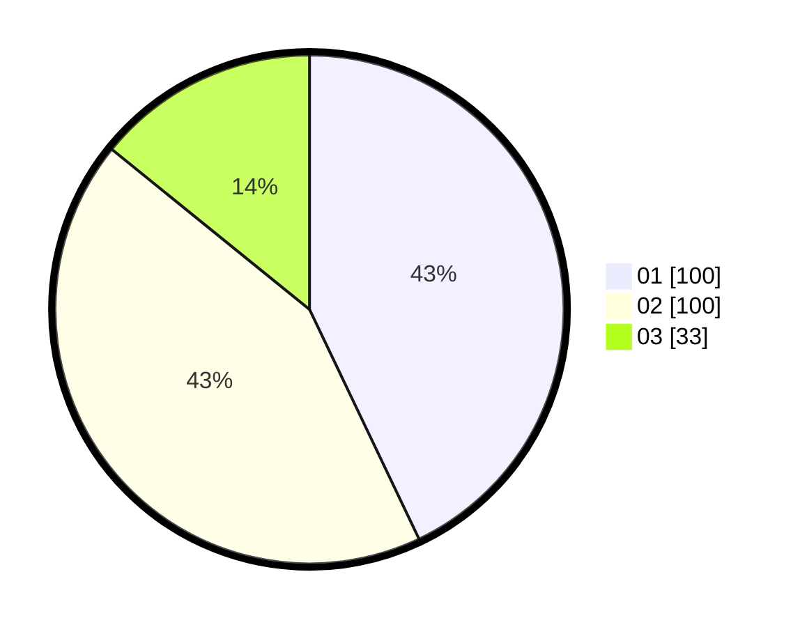

# Hasil

Hasil perolehan suara paslon dapat dilihat pada file paslon-01.txt, paslon-02.txt, dan paslon-03.txt.

Jika tidak ada, artinya data tersebut belum ada pada SIREKAP.

## Perolehan Suara

 * Paslon 01: **100**.
 * Paslon 02: **100**.
 * Paslon 03: **33**.

## Foto C Plano

https://sirekap-obj-formc.kpu.go.id/411b/pemilu/ppwp/31/71/08/10/02/3171081002064-20240216-020336--3f9c9905-066d-4542-ac67-49f5898a3a2d.jpg

https://sirekap-obj-formc.kpu.go.id/411b/pemilu/ppwp/31/71/08/10/02/3171081002064-20240216-020341--77a8795c-85ef-452f-814b-73eb39b4ec07.jpg

https://sirekap-obj-formc.kpu.go.id/411b/pemilu/ppwp/31/71/08/10/02/3171081002064-20240216-020340--921d419a-c3de-47f3-bec0-42a58ded420b.jpg

## DATA PEMILIH TETAP

Jumlah pemilih dalam DPT: **275**.
 * L: **136**.
 * P: **139**.

## DATA PENGGUNA HAK PILIH

Jumlah pengguna hak pilih dalam DPT: **235**.
 * L: **116**.
 * P: **119**.

Jumlah pengguna hak pilih dalam DPTb: **1**.
 * L: **0**.
 * P: **1**.

Jumlah pengguna hak pilih dalam DPK: **1**.
 * L: **1**.
 * P: **0**.

Jumlah pengguna hak pilih: **237**.
 * L: **117**.
 * P: **120**.

## JUMLAH SUARA SAH DAN TIDAK SAH

JUMLAH SELURUH SUARA SAH: **233**.

JUMLAH SUARA TIDAK SAH: **4**.

JUMLAH SELURUH SUARA SAH DAN SUARA TIDAK SAH: **237**.
