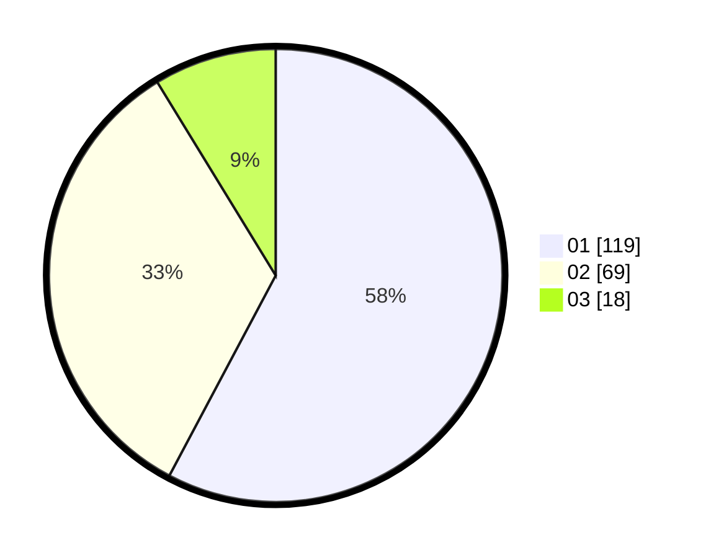

# Hasil

Hasil perolehan suara paslon dapat dilihat pada file paslon-01.txt, paslon-02.txt, dan paslon-03.txt.

Jika tidak ada, artinya data tersebut belum ada pada SIREKAP.

## Perolehan Suara

 * Paslon 01: **119**.
 * Paslon 02: **69**.
 * Paslon 03: **18**.

## Foto C Plano

https://sirekap-obj-formc.kpu.go.id/a44f/pemilu/ppwp/31/71/08/10/02/3171081002065-20240214-221512--19e70a90-8149-4365-9c54-a98095748041.jpg

https://sirekap-obj-formc.kpu.go.id/a44f/pemilu/ppwp/31/71/08/10/02/3171081002065-20240217-014752--98b1ea79-1481-48af-8fd2-13ffa10c9c1d.jpg

https://sirekap-obj-formc.kpu.go.id/a44f/pemilu/ppwp/31/71/08/10/02/3171081002065-20240217-014751--10515638-0542-45ca-8dfa-911e16f90d21.jpg

## DATA PEMILIH TETAP

Jumlah pemilih dalam DPT: **265**.
 * L: **339**.
 * P: **26**.

## DATA PENGGUNA HAK PILIH

Jumlah pengguna hak pilih dalam DPT: **206**.
 * L: **108**.
 * P: **98**.

Jumlah pengguna hak pilih dalam DPTb: **1**.
 * L: **7**.
 * P: **0**.

Jumlah pengguna hak pilih dalam DPK: **1**.
 * L: **1**.
 * P: **0**.

Jumlah pengguna hak pilih: **0**.
 * L: **0**.
 * P: **0**.

## JUMLAH SUARA SAH DAN TIDAK SAH

JUMLAH SELURUH SUARA SAH: **206**.

JUMLAH SUARA TIDAK SAH: **2**.

JUMLAH SELURUH SUARA SAH DAN SUARA TIDAK SAH: **208**.
