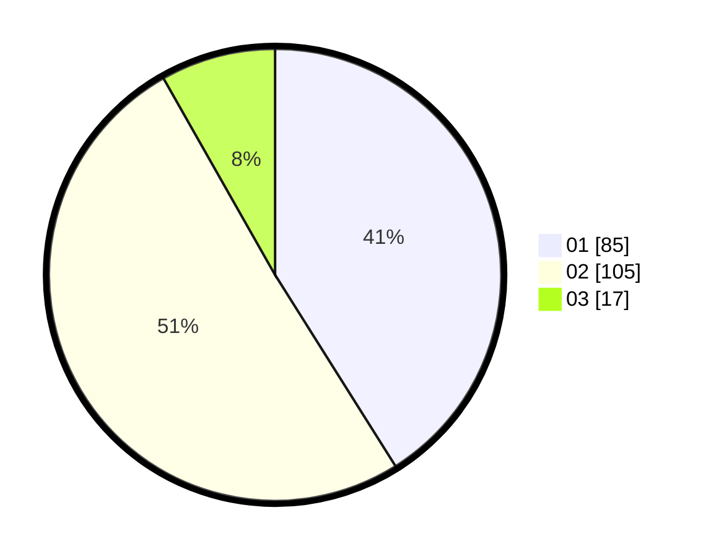

# Hasil

Hasil perolehan suara paslon dapat dilihat pada file paslon-01.txt, paslon-02.txt, dan paslon-03.txt.

Jika tidak ada, artinya data tersebut belum ada pada SIREKAP.

## Perolehan Suara

 * Paslon 01: **85**.
 * Paslon 02: **105**.
 * Paslon 03: **17**.

## Foto C Plano

https://sirekap-obj-formc.kpu.go.id/556b/pemilu/ppwp/31/71/08/10/02/3171081002068-20240215-015254--07a95ddb-682b-47c1-8c3a-871a4954e5bd.jpg

https://sirekap-obj-formc.kpu.go.id/556b/pemilu/ppwp/31/71/08/10/02/3171081002068-20240215-015407--b02b7b0f-a401-4c0c-ad46-4c7a20ca4835.jpg

https://sirekap-obj-formc.kpu.go.id/556b/pemilu/ppwp/31/71/08/10/02/3171081002068-20240215-015509--bfbf8c54-a1fb-4f87-87e9-21a621fe0cfa.jpg

## DATA PEMILIH TETAP

Jumlah pemilih dalam DPT: **260**.
 * L: **131**.
 * P: **129**.

## DATA PENGGUNA HAK PILIH

Jumlah pengguna hak pilih dalam DPT: **206**.
 * L: **99**.
 * P: **107**.

Jumlah pengguna hak pilih dalam DPTb: **1**.
 * L: **0**.
 * P: **1**.

Jumlah pengguna hak pilih dalam DPK: **2**.
 * L: **1**.
 * P: **1**.

Jumlah pengguna hak pilih: **209**.
 * L: **100**.
 * P: **109**.

## JUMLAH SUARA SAH DAN TIDAK SAH

JUMLAH SELURUH SUARA SAH: **207**.

JUMLAH SUARA TIDAK SAH: **2**.

JUMLAH SELURUH SUARA SAH DAN SUARA TIDAK SAH: **209**.
