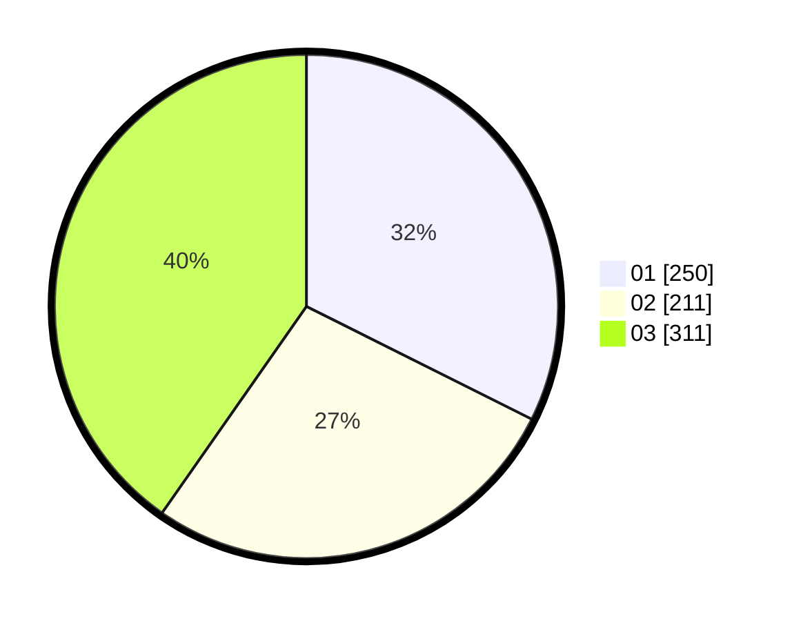

# Hasil

Hasil perolehan suara paslon dapat dilihat pada file paslon-01.txt, paslon-02.txt, dan paslon-03.txt.

Jika tidak ada, artinya data tersebut belum ada pada SIREKAP.

## Perolehan Suara

 * Paslon 01: **250**.
 * Paslon 02: **211**.
 * Paslon 03: **311**.

## Foto C Plano

https://sirekap-obj-formc.kpu.go.id/7612/pemilu/ppwp/31/71/08/10/02/3171081002071-20240216-120905--7ce05de9-b21c-438f-ad53-47c3cadfa61e.jpg

https://sirekap-obj-formc.kpu.go.id/7612/pemilu/ppwp/31/71/08/10/02/3171081002071-20240216-120913--e7919234-47c8-4812-8bb2-0a95cbc085d3.jpg

https://sirekap-obj-formc.kpu.go.id/7612/pemilu/ppwp/31/71/08/10/02/3171081002071-20240216-120908--4c1fcb55-9460-460c-a6ae-27ac1d0cc09c.jpg

## DATA PEMILIH TETAP

Jumlah pemilih dalam DPT: **0**.
 * L: **0**.
 * P: **0**.

## DATA PENGGUNA HAK PILIH

Jumlah pengguna hak pilih dalam DPT: **0**.
 * L: **0**.
 * P: **0**.

Jumlah pengguna hak pilih dalam DPTb: **0**.
 * L: **0**.
 * P: **0**.

Jumlah pengguna hak pilih dalam DPK: **0**.
 * L: **0**.
 * P: **0**.

Jumlah pengguna hak pilih: **0**.
 * L: **0**.
 * P: **0**.

## JUMLAH SUARA SAH DAN TIDAK SAH

JUMLAH SELURUH SUARA SAH: **175**.

JUMLAH SUARA TIDAK SAH: **6**.

JUMLAH SELURUH SUARA SAH DAN SUARA TIDAK SAH: **181**.
