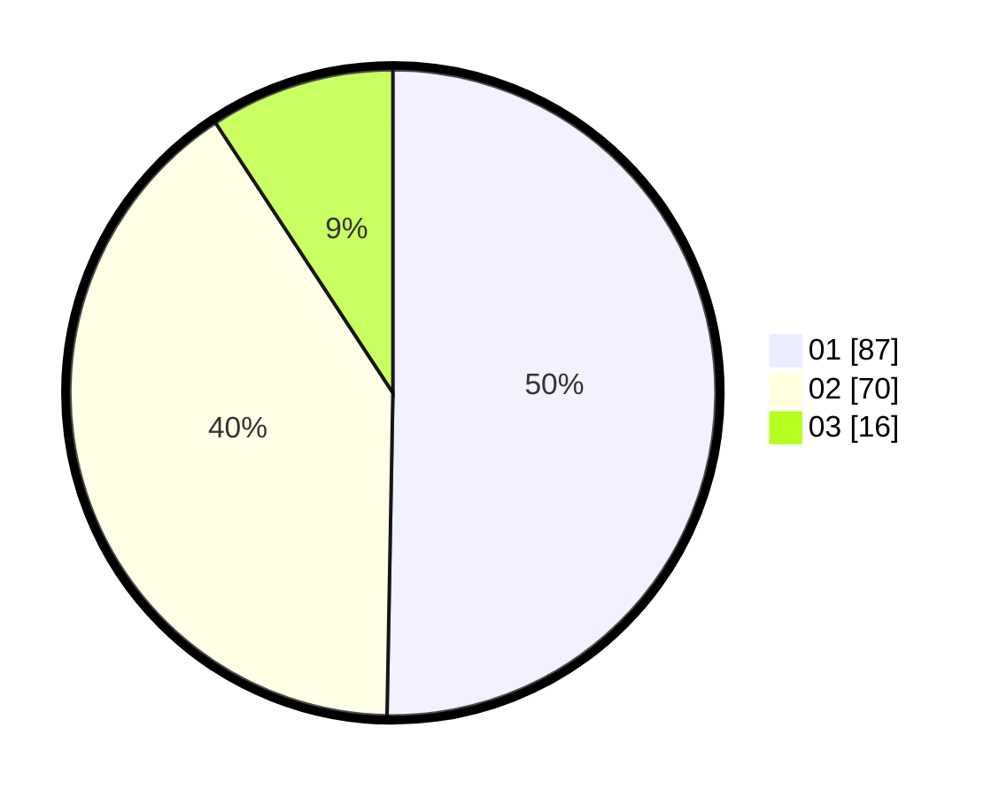

# Hasil

Hasil perolehan suara paslon dapat dilihat pada file paslon-01.txt, paslon-02.txt, dan paslon-03.txt.

Jika tidak ada, artinya data tersebut belum ada pada SIREKAP.

## Perolehan Suara

 * Paslon 01: **87**.
 * Paslon 02: **70**.
 * Paslon 03: **16**.

## Foto C Plano

https://sirekap-obj-formc.kpu.go.id/d35b/pemilu/ppwp/31/71/08/10/03/3171081003002-20240214-203225--f290b41d-b31a-448b-b31f-1c52e65e63db.jpg

https://sirekap-obj-formc.kpu.go.id/d35b/pemilu/ppwp/31/71/08/10/03/3171081003002-20240214-230339--99d7401d-cfd4-44ab-bb97-c38527c9e5c0.jpg

https://sirekap-obj-formc.kpu.go.id/d35b/pemilu/ppwp/31/71/08/10/03/3171081003002-20240214-203816--a8859da5-4d94-464f-9960-ea84c860f2f5.jpg

## DATA PEMILIH TETAP

Jumlah pemilih dalam DPT: **237**.
 * L: **125**.
 * P: **112**.

## DATA PENGGUNA HAK PILIH

Jumlah pengguna hak pilih dalam DPT: **168**.
 * L: **87**.
 * P: **81**.

Jumlah pengguna hak pilih dalam DPTb: **3**.
 * L: **3**.
 * P: **0**.

Jumlah pengguna hak pilih dalam DPK: **4**.
 * L: **2**.
 * P: **2**.

Jumlah pengguna hak pilih: **175**.
 * L: **92**.
 * P: **11**.

## JUMLAH SUARA SAH DAN TIDAK SAH

JUMLAH SELURUH SUARA SAH: **173**.

JUMLAH SUARA TIDAK SAH: **2**.

JUMLAH SELURUH SUARA SAH DAN SUARA TIDAK SAH: **2**.
