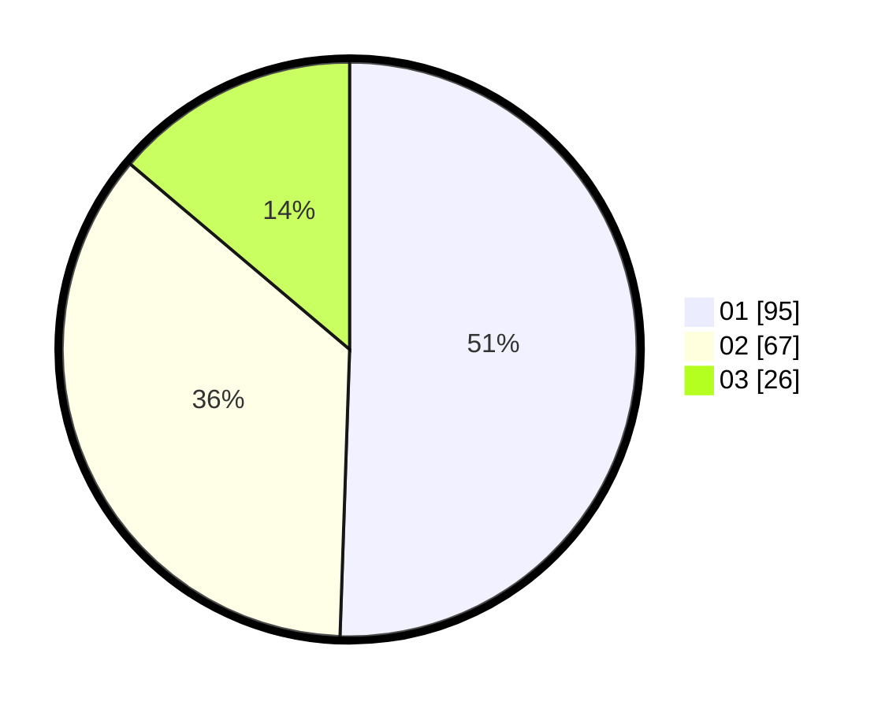

# Hasil

Hasil perolehan suara paslon dapat dilihat pada file paslon-01.txt, paslon-02.txt, dan paslon-03.txt.

Jika tidak ada, artinya data tersebut belum ada pada SIREKAP.

## Perolehan Suara

 * Paslon 01: **95**.
 * Paslon 02: **67**.
 * Paslon 03: **26**.

## Foto C Plano

https://sirekap-obj-formc.kpu.go.id/0934/pemilu/ppwp/31/71/08/10/03/3171081003003-20240214-203833--4c52255e-2be5-48ec-b392-03a3413d8f79.jpg

https://sirekap-obj-formc.kpu.go.id/0934/pemilu/ppwp/31/71/08/10/03/3171081003003-20240214-224920--bdefd43c-378e-47ee-b7c8-a46c3feab9f7.jpg

https://sirekap-obj-formc.kpu.go.id/0934/pemilu/ppwp/31/71/08/10/03/3171081003003-20240214-204510--552f7422-b214-494c-8112-9b9f6313c347.jpg

## DATA PEMILIH TETAP

Jumlah pemilih dalam DPT: **247**.
 * L: **124**.
 * P: **123**.

## DATA PENGGUNA HAK PILIH

Jumlah pengguna hak pilih dalam DPT: **184**.
 * L: **88**.
 * P: **96**.

Jumlah pengguna hak pilih dalam DPTb: **0**.
 * L: **0**.
 * P: **0**.

Jumlah pengguna hak pilih dalam DPK: **6**.
 * L: **2**.
 * P: **4**.

Jumlah pengguna hak pilih: **190**.
 * L: **90**.
 * P: **100**.

## JUMLAH SUARA SAH DAN TIDAK SAH

JUMLAH SELURUH SUARA SAH: **188**.

JUMLAH SUARA TIDAK SAH: **2**.

JUMLAH SELURUH SUARA SAH DAN SUARA TIDAK SAH: **190**.
