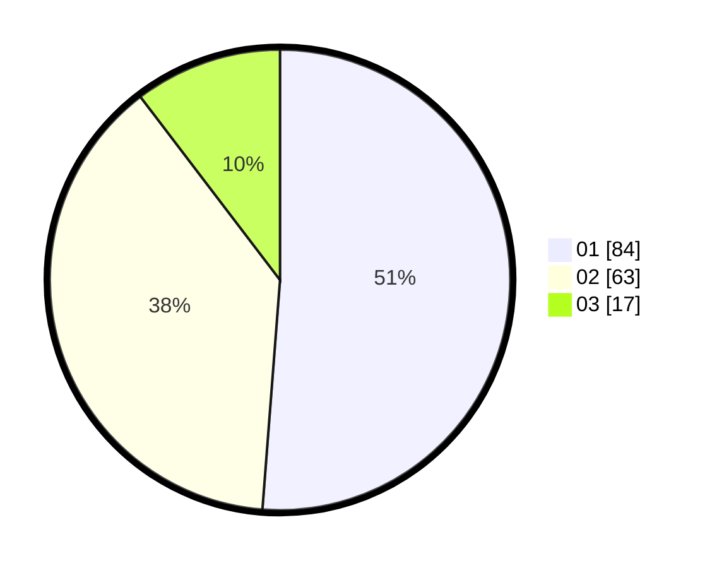

# Hasil

Hasil perolehan suara paslon dapat dilihat pada file paslon-01.txt, paslon-02.txt, dan paslon-03.txt.

Jika tidak ada, artinya data tersebut belum ada pada SIREKAP.

## Perolehan Suara

 * Paslon 01: **84**.
 * Paslon 02: **63**.
 * Paslon 03: **17**.

## Foto C Plano

https://sirekap-obj-formc.kpu.go.id/9233/pemilu/ppwp/31/71/08/10/03/3171081003005-20240216-135138--ea5dd3b2-4dac-4f46-9cb6-6f53621cc738.jpg

https://sirekap-obj-formc.kpu.go.id/9233/pemilu/ppwp/31/71/08/10/03/3171081003005-20240216-135139--7b6d021d-576d-41b5-99f3-a3769cd8ad80.jpg

https://sirekap-obj-formc.kpu.go.id/9233/pemilu/ppwp/31/71/08/10/03/3171081003005-20240216-135138--b9f667a4-e5c7-49ce-ac5c-952d50ca5c34.jpg

## DATA PEMILIH TETAP

Jumlah pemilih dalam DPT: **242**.
 * L: **131**.
 * P: **111**.

## DATA PENGGUNA HAK PILIH

Jumlah pengguna hak pilih dalam DPT: **165**.
 * L: **81**.
 * P: **84**.

Jumlah pengguna hak pilih dalam DPTb: **1**.
 * L: **1**.
 * P: **0**.

Jumlah pengguna hak pilih dalam DPK: **0**.
 * L: **0**.
 * P: **0**.

Jumlah pengguna hak pilih: **166**.
 * L: **82**.
 * P: **84**.

## JUMLAH SUARA SAH DAN TIDAK SAH

JUMLAH SELURUH SUARA SAH: **164**.

JUMLAH SUARA TIDAK SAH: **2**.

JUMLAH SELURUH SUARA SAH DAN SUARA TIDAK SAH: **166**.
