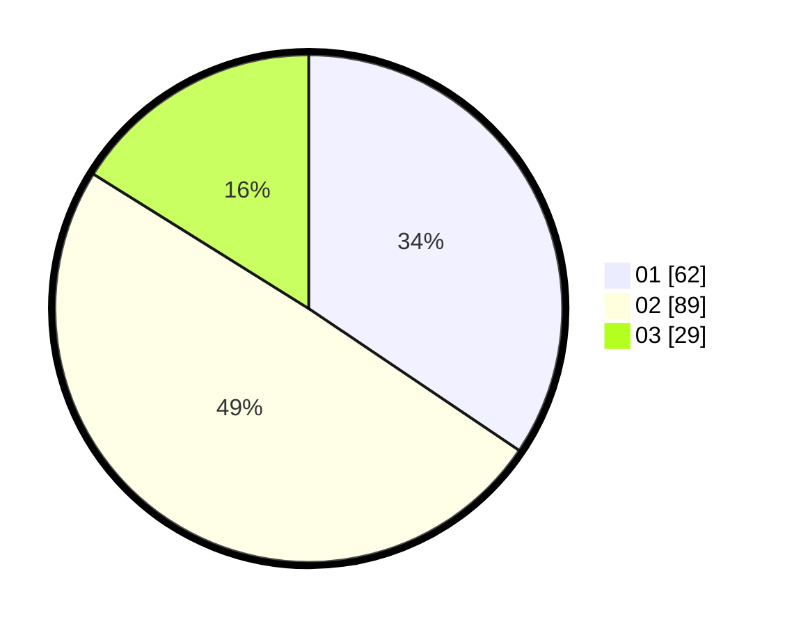

# Hasil

Hasil perolehan suara paslon dapat dilihat pada file paslon-01.txt, paslon-02.txt, dan paslon-03.txt.

Jika tidak ada, artinya data tersebut belum ada pada SIREKAP.

## Perolehan Suara

 * Paslon 01: **62**.
 * Paslon 02: **89**.
 * Paslon 03: **29**.

## Foto C Plano

https://sirekap-obj-formc.kpu.go.id/9f5d/pemilu/ppwp/31/71/08/10/03/3171081003006-20240216-000244--4765b6a2-0009-4ef2-a61e-772dd052b409.jpg

https://sirekap-obj-formc.kpu.go.id/9f5d/pemilu/ppwp/31/71/08/10/03/3171081003006-20240216-000245--2c32fe8f-f150-4bba-885a-6ced2661c89d.jpg

https://sirekap-obj-formc.kpu.go.id/9f5d/pemilu/ppwp/31/71/08/10/03/3171081003006-20240216-000244--98c883ae-9390-48cd-a3b8-99ddc5a8784b.jpg

## DATA PEMILIH TETAP

Jumlah pemilih dalam DPT: **249**.
 * L: **127**.
 * P: **122**.

## DATA PENGGUNA HAK PILIH

Jumlah pengguna hak pilih dalam DPT: **181**.
 * L: **95**.
 * P: **86**.

Jumlah pengguna hak pilih dalam DPTb: **0**.
 * L: **0**.
 * P: **0**.

Jumlah pengguna hak pilih dalam DPK: **1**.
 * L: **1**.
 * P: **0**.

Jumlah pengguna hak pilih: **182**.
 * L: **96**.
 * P: **86**.

## JUMLAH SUARA SAH DAN TIDAK SAH

JUMLAH SELURUH SUARA SAH: **180**.

JUMLAH SUARA TIDAK SAH: **2**.

JUMLAH SELURUH SUARA SAH DAN SUARA TIDAK SAH: **182**.
