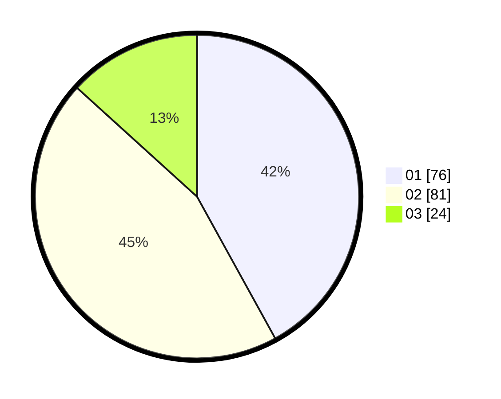

# Hasil

Hasil perolehan suara paslon dapat dilihat pada file paslon-01.txt, paslon-02.txt, dan paslon-03.txt.

Jika tidak ada, artinya data tersebut belum ada pada SIREKAP.

## Perolehan Suara

 * Paslon 01: **76**.
 * Paslon 02: **81**.
 * Paslon 03: **24**.

## Foto C Plano

https://sirekap-obj-formc.kpu.go.id/4a08/pemilu/ppwp/31/71/08/10/03/3171081003007-20240214-225855--c0c26586-3602-43a2-b341-262e11d8531e.jpg

https://sirekap-obj-formc.kpu.go.id/4a08/pemilu/ppwp/31/71/08/10/03/3171081003007-20240214-230151--61beb5de-9598-46dd-a048-7dc7ca229bd1.jpg

https://sirekap-obj-formc.kpu.go.id/4a08/pemilu/ppwp/31/71/08/10/03/3171081003007-20240214-230447--0990c17f-9c2c-43a7-af87-2a4a3d28fdcd.jpg

## DATA PEMILIH TETAP

Jumlah pemilih dalam DPT: **258**.
 * L: **134**.
 * P: **124**.

## DATA PENGGUNA HAK PILIH

Jumlah pengguna hak pilih dalam DPT: **184**.
 * L: **94**.
 * P: **90**.

Jumlah pengguna hak pilih dalam DPTb: **2**.
 * L: **0**.
 * P: **2**.

Jumlah pengguna hak pilih dalam DPK: **0**.
 * L: **0**.
 * P: **0**.

Jumlah pengguna hak pilih: **186**.
 * L: **94**.
 * P: **92**.

## JUMLAH SUARA SAH DAN TIDAK SAH

JUMLAH SELURUH SUARA SAH: **181**.

JUMLAH SUARA TIDAK SAH: **5**.

JUMLAH SELURUH SUARA SAH DAN SUARA TIDAK SAH: **186**.
