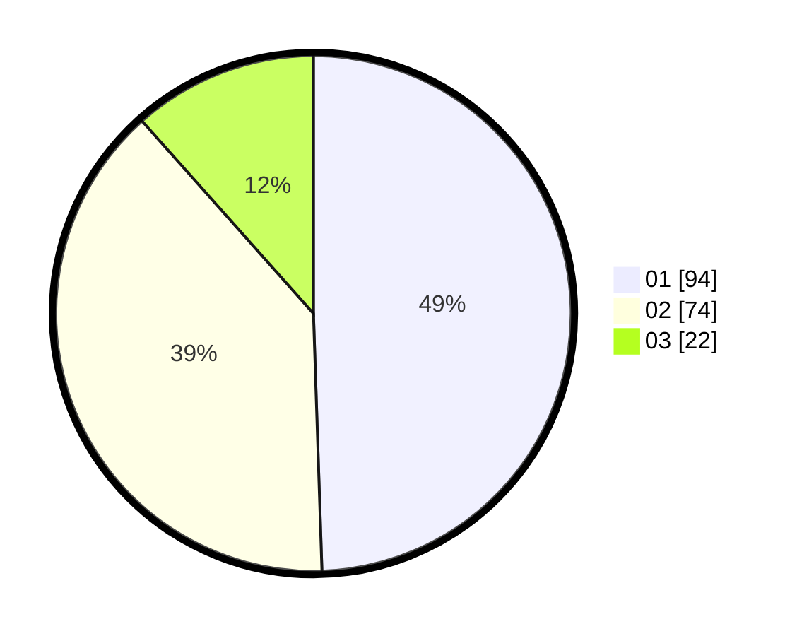

# Hasil

Hasil perolehan suara paslon dapat dilihat pada file paslon-01.txt, paslon-02.txt, dan paslon-03.txt.

Jika tidak ada, artinya data tersebut belum ada pada SIREKAP.

## Perolehan Suara

 * Paslon 01: **94**.
 * Paslon 02: **74**.
 * Paslon 03: **22**.

## Foto C Plano

https://sirekap-obj-formc.kpu.go.id/b858/pemilu/ppwp/31/71/08/10/03/3171081003008-20240215-001054--2b6b42a7-315e-49db-a226-db3adca3a732.jpg

https://sirekap-obj-formc.kpu.go.id/b858/pemilu/ppwp/31/71/08/10/03/3171081003008-20240215-001340--508d5095-4259-4ff4-9d25-f2093949b56e.jpg
