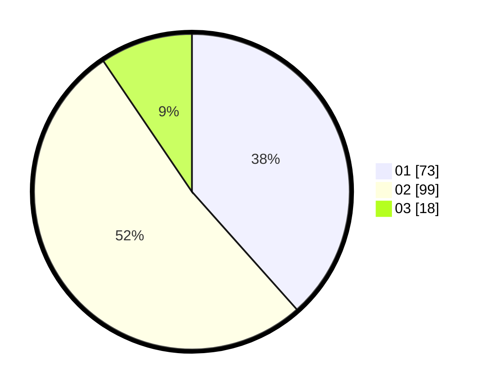

# Hasil

Hasil perolehan suara paslon dapat dilihat pada file paslon-01.txt, paslon-02.txt, dan paslon-03.txt.

Jika tidak ada, artinya data tersebut belum ada pada SIREKAP.

## Perolehan Suara

 * Paslon 01: **73**.
 * Paslon 02: **99**.
 * Paslon 03: **18**.

## Foto C Plano

https://sirekap-obj-formc.kpu.go.id/a047/pemilu/ppwp/31/71/08/10/03/3171081003010-20240216-190749--a7c98298-f747-4a77-bbff-cae08d899c24.jpg

https://sirekap-obj-formc.kpu.go.id/a047/pemilu/ppwp/31/71/08/10/03/3171081003010-20240216-153730--001643cf-6d88-49f0-84de-d749003460d3.jpg

https://sirekap-obj-formc.kpu.go.id/a047/pemilu/ppwp/31/71/08/10/03/3171081003010-20240216-192404--2ff1915d-6956-477b-80d3-e6d8c5af346b.jpg

## DATA PEMILIH TETAP

Jumlah pemilih dalam DPT: **261**.
 * L: **138**.
 * P: **123**.

## DATA PENGGUNA HAK PILIH

Jumlah pengguna hak pilih dalam DPT: **193**.
 * L: **96**.
 * P: **97**.

Jumlah pengguna hak pilih dalam DPTb: **1**.
 * L: **1**.
 * P: **0**.

Jumlah pengguna hak pilih dalam DPK: **0**.
 * L: **0**.
 * P: **0**.

Jumlah pengguna hak pilih: **194**.
 * L: **97**.
 * P: **97**.

## JUMLAH SUARA SAH DAN TIDAK SAH

JUMLAH SELURUH SUARA SAH: **190**.

JUMLAH SUARA TIDAK SAH: **4**.

JUMLAH SELURUH SUARA SAH DAN SUARA TIDAK SAH: **194**.
