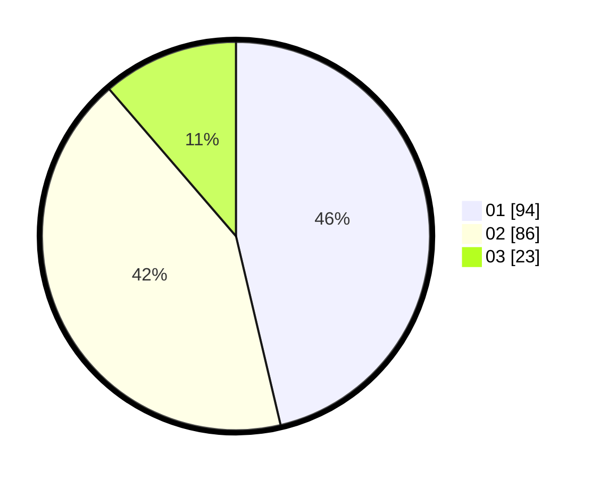

# Hasil

Hasil perolehan suara paslon dapat dilihat pada file paslon-01.txt, paslon-02.txt, dan paslon-03.txt.

Jika tidak ada, artinya data tersebut belum ada pada SIREKAP.

## Perolehan Suara

 * Paslon 01: **94**.
 * Paslon 02: **86**.
 * Paslon 03: **23**.

## Foto C Plano

https://sirekap-obj-formc.kpu.go.id/0ae9/pemilu/ppwp/31/71/08/10/03/3171081003016-20240216-011658--e8513e51-3c31-4cac-b338-c78e7afb70c7.jpg

https://sirekap-obj-formc.kpu.go.id/0ae9/pemilu/ppwp/31/71/08/10/03/3171081003016-20240216-001824--3ca41bb8-4cfc-4af9-9d7f-7f2b72f4a4b4.jpg

https://sirekap-obj-formc.kpu.go.id/0ae9/pemilu/ppwp/31/71/08/10/03/3171081003016-20240216-011708--6e446e8c-da00-46b1-a345-749b27d252bd.jpg

## DATA PEMILIH TETAP

Jumlah pemilih dalam DPT: **261**.
 * L: **139**.
 * P: **122**.

## DATA PENGGUNA HAK PILIH

Jumlah pengguna hak pilih dalam DPT: **211**.
 * L: **109**.
 * P: **102**.

Jumlah pengguna hak pilih dalam DPTb: **0**.
 * L: **0**.
 * P: **0**.

Jumlah pengguna hak pilih dalam DPK: **1**.
 * L: **1**.
 * P: **0**.

Jumlah pengguna hak pilih: **212**.
 * L: **110**.
 * P: **102**.

## JUMLAH SUARA SAH DAN TIDAK SAH

JUMLAH SELURUH SUARA SAH: **203**.

JUMLAH SUARA TIDAK SAH: **9**.

JUMLAH SELURUH SUARA SAH DAN SUARA TIDAK SAH: **212**.
