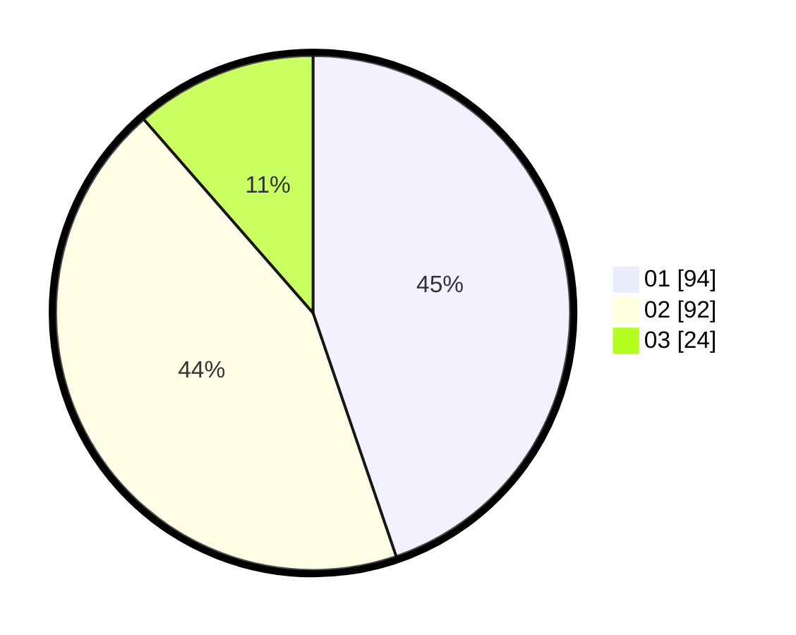

# Hasil

Hasil perolehan suara paslon dapat dilihat pada file paslon-01.txt, paslon-02.txt, dan paslon-03.txt.

Jika tidak ada, artinya data tersebut belum ada pada SIREKAP.

## Perolehan Suara

 * Paslon 01: **94**.
 * Paslon 02: **92**.
 * Paslon 03: **24**.

## Foto C Plano

https://sirekap-obj-formc.kpu.go.id/ec62/pemilu/ppwp/31/71/08/10/03/3171081003018-20240214-233232--3add5cce-1118-4931-b319-40dea5a2aefa.jpg

https://sirekap-obj-formc.kpu.go.id/ec62/pemilu/ppwp/31/71/08/10/03/3171081003018-20240214-233253--fd443857-eb22-4274-b4dd-ef24c7448fa9.jpg

https://sirekap-obj-formc.kpu.go.id/ec62/pemilu/ppwp/31/71/08/10/03/3171081003018-20240214-233312--83c7c2e8-5fe1-4cc7-9f3a-de0c1dddcd1b.jpg

## DATA PEMILIH TETAP

Jumlah pemilih dalam DPT: **261**.
 * L: **134**.
 * P: **127**.

## DATA PENGGUNA HAK PILIH

Jumlah pengguna hak pilih dalam DPT: **210**.
 * L: **105**.
 * P: **105**.

Jumlah pengguna hak pilih dalam DPTb: **4**.
 * L: **2**.
 * P: **2**.

Jumlah pengguna hak pilih dalam DPK: **3**.
 * L: **1**.
 * P: **2**.

Jumlah pengguna hak pilih: **217**.
 * L: **108**.
 * P: **109**.

## JUMLAH SUARA SAH DAN TIDAK SAH

JUMLAH SELURUH SUARA SAH: **210**.

JUMLAH SUARA TIDAK SAH: **7**.

JUMLAH SELURUH SUARA SAH DAN SUARA TIDAK SAH: **217**.
