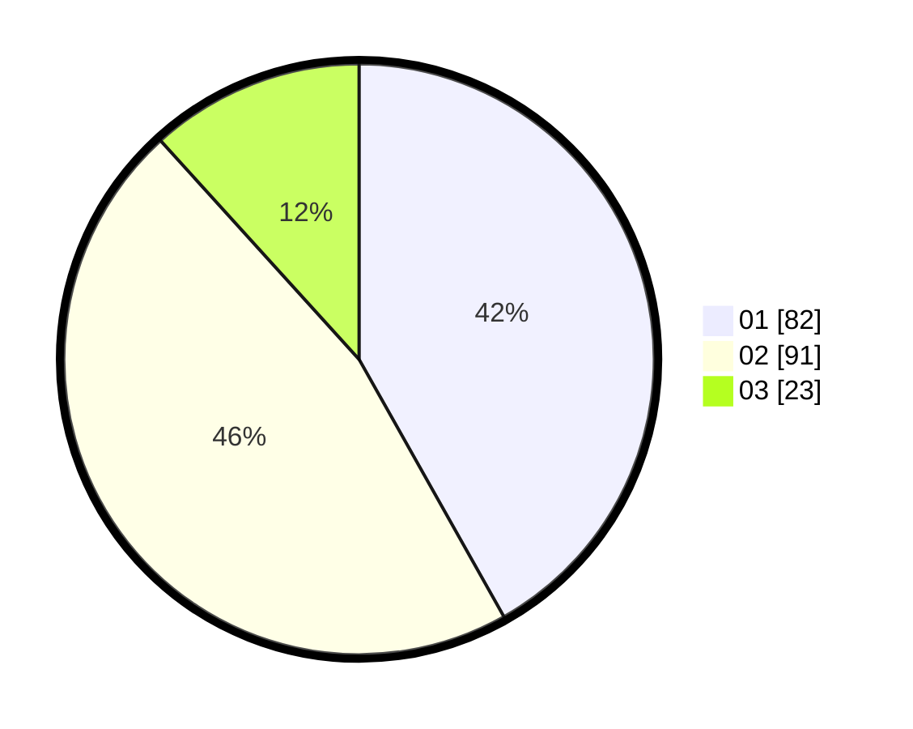

# Hasil

Hasil perolehan suara paslon dapat dilihat pada file paslon-01.txt, paslon-02.txt, dan paslon-03.txt.

Jika tidak ada, artinya data tersebut belum ada pada SIREKAP.

## Perolehan Suara

 * Paslon 01: **82**.
 * Paslon 02: **91**.
 * Paslon 03: **23**.

## Foto C Plano

https://sirekap-obj-formc.kpu.go.id/e807/pemilu/ppwp/31/71/08/10/03/3171081003019-20240216-172034--c5687e57-e626-4164-a024-d3b6e76d5c2c.jpg

https://sirekap-obj-formc.kpu.go.id/e807/pemilu/ppwp/31/71/08/10/03/3171081003019-20240216-172035--8c390007-0eb7-4ac1-8689-d2c2579779ed.jpg

https://sirekap-obj-formc.kpu.go.id/e807/pemilu/ppwp/31/71/08/10/03/3171081003019-20240216-172035--38a66dc7-e296-4c48-8f00-6ac2c750d174.jpg

## DATA PEMILIH TETAP

Jumlah pemilih dalam DPT: **261**.
 * L: **143**.
 * P: **118**.

## DATA PENGGUNA HAK PILIH

Jumlah pengguna hak pilih dalam DPT: **197**.
 * L: **101**.
 * P: **96**.

Jumlah pengguna hak pilih dalam DPTb: **4**.
 * L: **3**.
 * P: **1**.

Jumlah pengguna hak pilih dalam DPK: **0**.
 * L: **0**.
 * P: **0**.

Jumlah pengguna hak pilih: **201**.
 * L: **104**.
 * P: **97**.

## JUMLAH SUARA SAH DAN TIDAK SAH

JUMLAH SELURUH SUARA SAH: **196**.

JUMLAH SUARA TIDAK SAH: **5**.

JUMLAH SELURUH SUARA SAH DAN SUARA TIDAK SAH: **201**.
