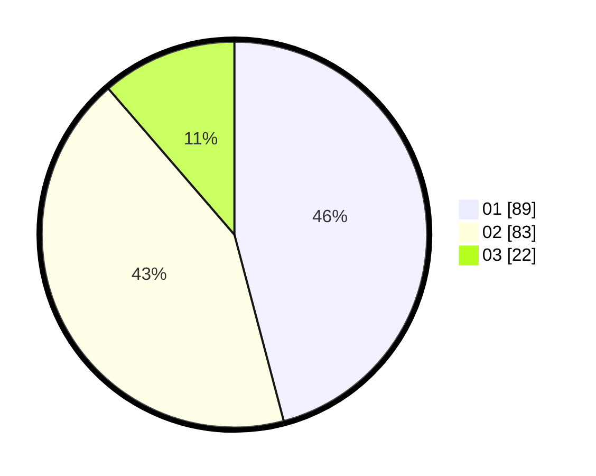

# Hasil

Hasil perolehan suara paslon dapat dilihat pada file paslon-01.txt, paslon-02.txt, dan paslon-03.txt.

Jika tidak ada, artinya data tersebut belum ada pada SIREKAP.

## Perolehan Suara

 * Paslon 01: **89**.
 * Paslon 02: **83**.
 * Paslon 03: **22**.

## Foto C Plano

https://sirekap-obj-formc.kpu.go.id/b5c4/pemilu/ppwp/31/71/08/10/03/3171081003025-20240214-202414--01d777c7-0a89-4778-995b-310ae72087e7.jpg

https://sirekap-obj-formc.kpu.go.id/b5c4/pemilu/ppwp/31/71/08/10/03/3171081003025-20240214-193157--8c3affcb-e7b7-4f1c-9a7d-0ad54464056a.jpg

https://sirekap-obj-formc.kpu.go.id/b5c4/pemilu/ppwp/31/71/08/10/03/3171081003025-20240214-193303--c54f6a4e-64a6-4c68-93ba-94cf9cfac469.jpg
