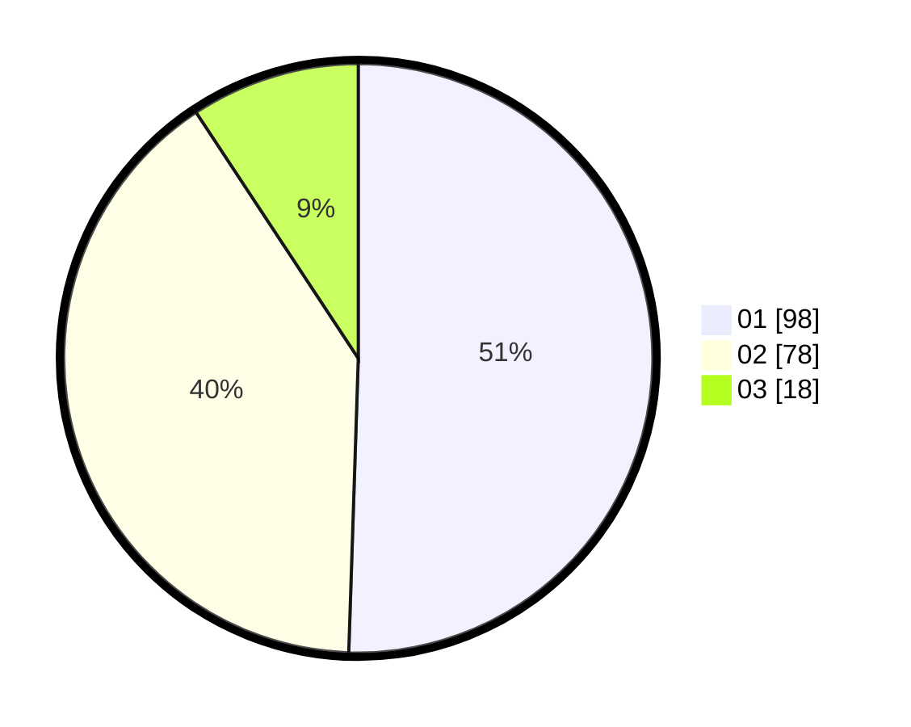

# Hasil

Hasil perolehan suara paslon dapat dilihat pada file paslon-01.txt, paslon-02.txt, dan paslon-03.txt.

Jika tidak ada, artinya data tersebut belum ada pada SIREKAP.

## Perolehan Suara

 * Paslon 01: **98**.
 * Paslon 02: **78**.
 * Paslon 03: **18**.

## Foto C Plano

https://sirekap-obj-formc.kpu.go.id/6839/pemilu/ppwp/31/71/08/10/03/3171081003026-20240214-184745--085ab552-41f0-433a-bf4e-905f837f6fd8.jpg

https://sirekap-obj-formc.kpu.go.id/6839/pemilu/ppwp/31/71/08/10/03/3171081003026-20240214-184755--0eb612ec-1284-4fde-859f-02c43992cf79.jpg

https://sirekap-obj-formc.kpu.go.id/6839/pemilu/ppwp/31/71/08/10/03/3171081003026-20240214-184804--a3f3c9be-0aa5-4ead-a17a-124aa3213eca.jpg

## DATA PEMILIH TETAP

Jumlah pemilih dalam DPT: **252**.
 * L: **126**.
 * P: **126**.

## DATA PENGGUNA HAK PILIH

Jumlah pengguna hak pilih dalam DPT: **187**.
 * L: **91**.
 * P: **96**.

Jumlah pengguna hak pilih dalam DPTb: **9**.
 * L: **5**.
 * P: **4**.

Jumlah pengguna hak pilih dalam DPK: **2**.
 * L: **0**.
 * P: **2**.

Jumlah pengguna hak pilih: **198**.
 * L: **96**.
 * P: **102**.

## JUMLAH SUARA SAH DAN TIDAK SAH

JUMLAH SELURUH SUARA SAH: **194**.

JUMLAH SUARA TIDAK SAH: **4**.

JUMLAH SELURUH SUARA SAH DAN SUARA TIDAK SAH: **198**.
