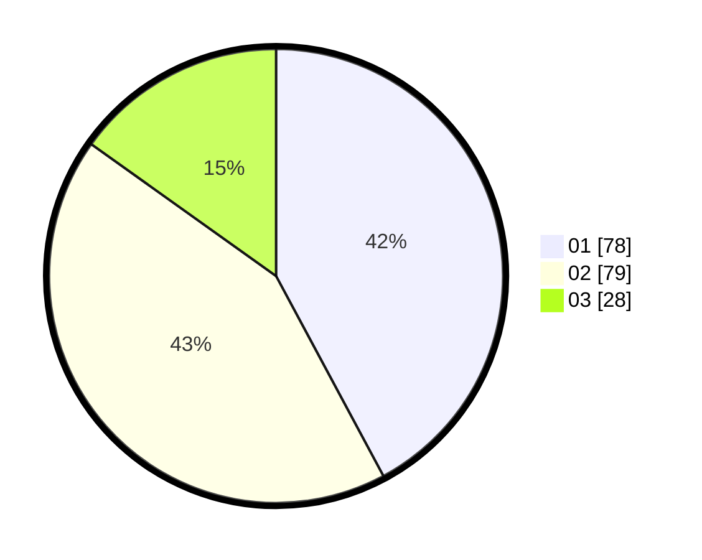

# Hasil

Hasil perolehan suara paslon dapat dilihat pada file paslon-01.txt, paslon-02.txt, dan paslon-03.txt.

Jika tidak ada, artinya data tersebut belum ada pada SIREKAP.

## Perolehan Suara

 * Paslon 01: **78**.
 * Paslon 02: **79**.
 * Paslon 03: **28**.

## Foto C Plano

https://sirekap-obj-formc.kpu.go.id/d662/pemilu/ppwp/31/71/08/10/03/3171081003027-20240215-003406--66c1b24d-60e5-412c-911b-c9ebc123ef07.jpg

https://sirekap-obj-formc.kpu.go.id/d662/pemilu/ppwp/31/71/08/10/03/3171081003027-20240215-003705--651d58df-3771-414b-8cf8-e3a8ec6835d4.jpg

https://sirekap-obj-formc.kpu.go.id/d662/pemilu/ppwp/31/71/08/10/03/3171081003027-20240215-003827--8473fab7-e0ef-41c1-b2d9-e717f15a4a6e.jpg

## DATA PEMILIH TETAP

Jumlah pemilih dalam DPT: **255**.
 * L: **133**.
 * P: **122**.

## DATA PENGGUNA HAK PILIH

Jumlah pengguna hak pilih dalam DPT: **176**.
 * L: **89**.
 * P: **87**.

Jumlah pengguna hak pilih dalam DPTb: **11**.
 * L: **3**.
 * P: **8**.

Jumlah pengguna hak pilih dalam DPK: **0**.
 * L: **0**.
 * P: **0**.

Jumlah pengguna hak pilih: **187**.
 * L: **92**.
 * P: **95**.

## JUMLAH SUARA SAH DAN TIDAK SAH

JUMLAH SELURUH SUARA SAH: **185**.

JUMLAH SUARA TIDAK SAH: **2**.

JUMLAH SELURUH SUARA SAH DAN SUARA TIDAK SAH: **187**.
