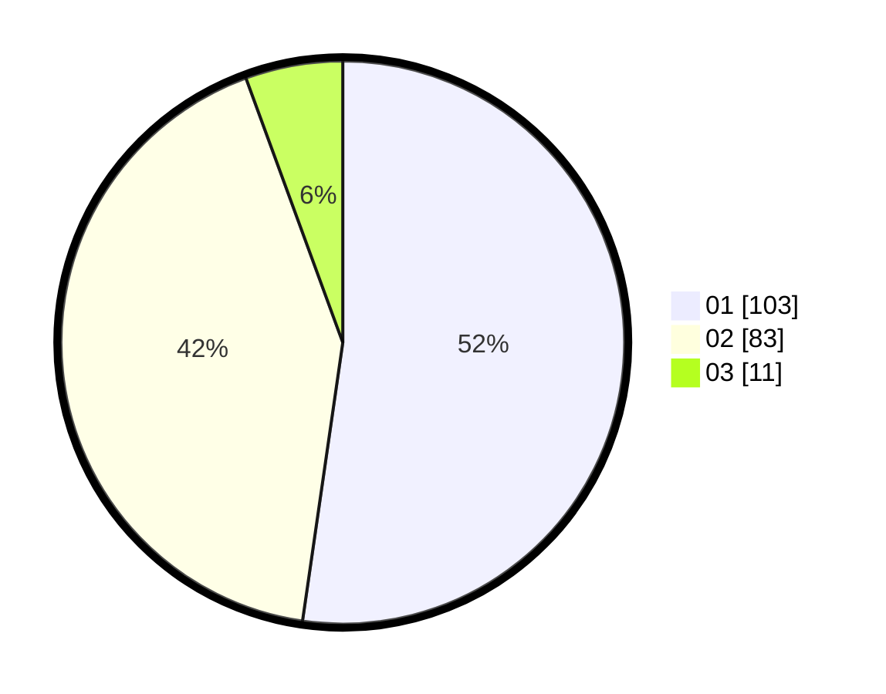

# Hasil

Hasil perolehan suara paslon dapat dilihat pada file paslon-01.txt, paslon-02.txt, dan paslon-03.txt.

Jika tidak ada, artinya data tersebut belum ada pada SIREKAP.

## Perolehan Suara

 * Paslon 01: **103**.
 * Paslon 02: **83**.
 * Paslon 03: **11**.

## Foto C Plano

https://sirekap-obj-formc.kpu.go.id/3db1/pemilu/ppwp/31/71/08/10/03/3171081003029-20240214-190005--0b2d3411-29ec-4e8c-99bf-ae415cbdce37.jpg

https://sirekap-obj-formc.kpu.go.id/3db1/pemilu/ppwp/31/71/08/10/03/3171081003029-20240214-190146--c9ff9f49-f76d-42bd-9644-9eda6d4633b0.jpg

https://sirekap-obj-formc.kpu.go.id/3db1/pemilu/ppwp/31/71/08/10/03/3171081003029-20240214-190322--3fe6e70f-6012-4637-ae72-54ae69845139.jpg
