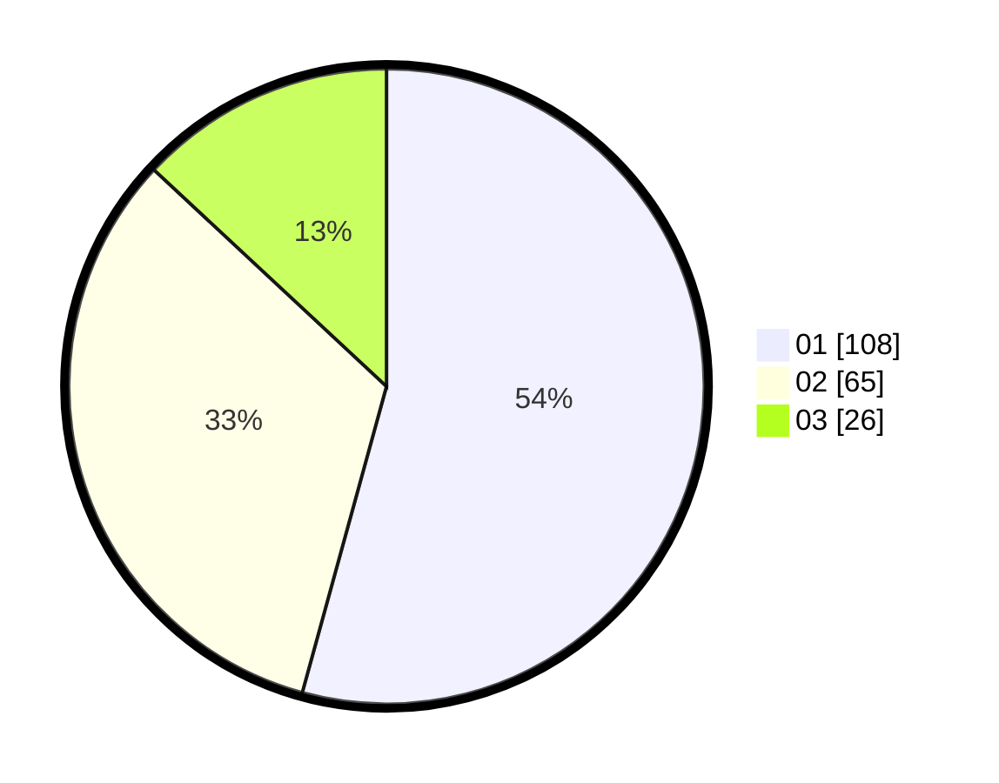

# Hasil

Hasil perolehan suara paslon dapat dilihat pada file paslon-01.txt, paslon-02.txt, dan paslon-03.txt.

Jika tidak ada, artinya data tersebut belum ada pada SIREKAP.

## Perolehan Suara

 * Paslon 01: **108**.
 * Paslon 02: **65**.
 * Paslon 03: **26**.

## Foto C Plano

https://sirekap-obj-formc.kpu.go.id/3d82/pemilu/ppwp/31/71/08/10/03/3171081003034-20240214-155514--da0951ad-8969-4251-9ed9-3d55da3f37ad.jpg

https://sirekap-obj-formc.kpu.go.id/3d82/pemilu/ppwp/31/71/08/10/03/3171081003034-20240214-160122--88a6ea2e-7005-422d-9bb7-99ccfabc186c.jpg
