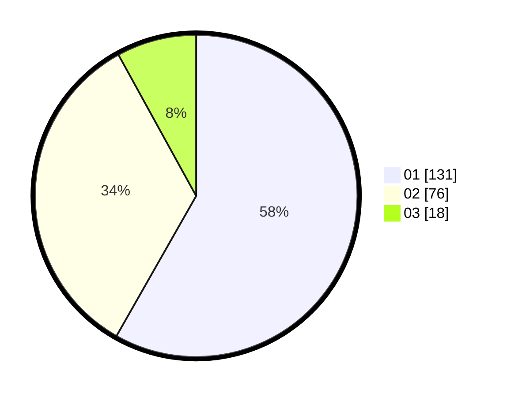

# Hasil

Hasil perolehan suara paslon dapat dilihat pada file paslon-01.txt, paslon-02.txt, dan paslon-03.txt.

Jika tidak ada, artinya data tersebut belum ada pada SIREKAP.

## Perolehan Suara

 * Paslon 01: **131**.
 * Paslon 02: **76**.
 * Paslon 03: **18**.

## Foto C Plano

https://sirekap-obj-formc.kpu.go.id/502c/pemilu/ppwp/31/71/08/10/03/3171081003038-20240215-015358--3837f01b-4cc4-44bd-8d46-8d1b16a89016.jpg

https://sirekap-obj-formc.kpu.go.id/502c/pemilu/ppwp/31/71/08/10/03/3171081003038-20240215-015207--f884e412-73cb-409c-9a4f-363f322dc9a6.jpg

https://sirekap-obj-formc.kpu.go.id/502c/pemilu/ppwp/31/71/08/10/03/3171081003038-20240215-015301--340e577c-cf46-4860-a290-9d6218610339.jpg

## DATA PEMILIH TETAP

Jumlah pemilih dalam DPT: **181**.
 * L: **146**.
 * P: **135**.

## DATA PENGGUNA HAK PILIH

Jumlah pengguna hak pilih dalam DPT: **221**.
 * L: **116**.
 * P: **105**.

Jumlah pengguna hak pilih dalam DPTb: **4**.
 * L: **2**.
 * P: **2**.

Jumlah pengguna hak pilih dalam DPK: **1**.
 * L: **0**.
 * P: **1**.

Jumlah pengguna hak pilih: **226**.
 * L: **118**.
 * P: **108**.

## JUMLAH SUARA SAH DAN TIDAK SAH

JUMLAH SELURUH SUARA SAH: **225**.

JUMLAH SUARA TIDAK SAH: **1**.

JUMLAH SELURUH SUARA SAH DAN SUARA TIDAK SAH: **226**.
