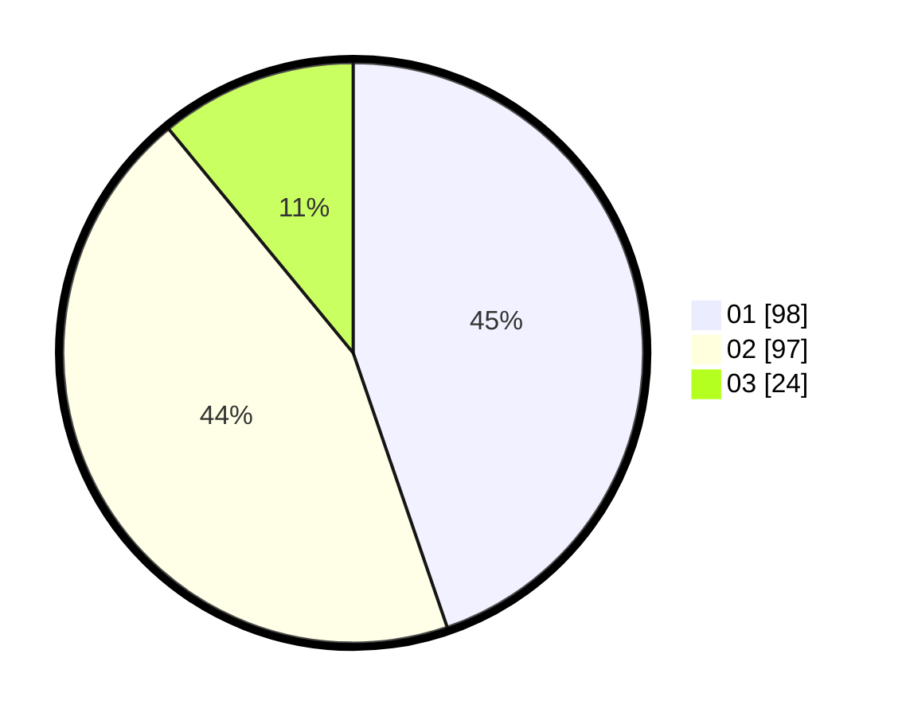

# Hasil

Hasil perolehan suara paslon dapat dilihat pada file paslon-01.txt, paslon-02.txt, dan paslon-03.txt.

Jika tidak ada, artinya data tersebut belum ada pada SIREKAP.

## Perolehan Suara

 * Paslon 01: **98**.
 * Paslon 02: **97**.
 * Paslon 03: **24**.

## Foto C Plano

https://sirekap-obj-formc.kpu.go.id/7697/pemilu/ppwp/31/71/08/10/03/3171081003041-20240215-015116--bfea79b3-8741-4d8f-89e9-cb34b07a609f.jpg

https://sirekap-obj-formc.kpu.go.id/7697/pemilu/ppwp/31/71/08/10/03/3171081003041-20240215-025728--357d89db-8dab-4a16-b60c-f27ca0738f20.jpg

https://sirekap-obj-formc.kpu.go.id/7697/pemilu/ppwp/31/71/08/10/03/3171081003041-20240215-025810--2f551604-b248-4c23-bb88-f35013821b31.jpg

## DATA PEMILIH TETAP

Jumlah pemilih dalam DPT: **278**.
 * L: **135**.
 * P: **143**.

## DATA PENGGUNA HAK PILIH

Jumlah pengguna hak pilih dalam DPT: **223**.
 * L: **108**.
 * P: **115**.

Jumlah pengguna hak pilih dalam DPTb: **0**.
 * L: **0**.
 * P: **0**.

Jumlah pengguna hak pilih dalam DPK: **2**.
 * L: **1**.
 * P: **1**.

Jumlah pengguna hak pilih: **225**.
 * L: **109**.
 * P: **116**.

## JUMLAH SUARA SAH DAN TIDAK SAH

JUMLAH SELURUH SUARA SAH: **219**.

JUMLAH SUARA TIDAK SAH: **6**.

JUMLAH SELURUH SUARA SAH DAN SUARA TIDAK SAH: **225**.
