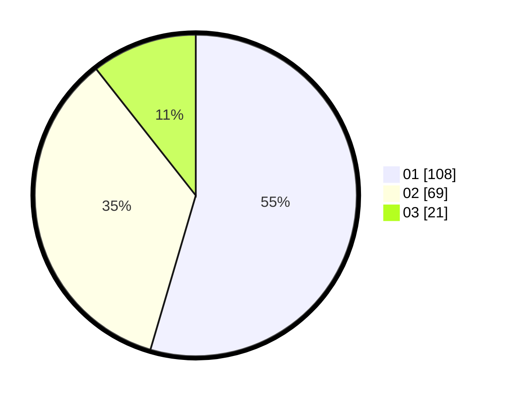

# Hasil

Hasil perolehan suara paslon dapat dilihat pada file paslon-01.txt, paslon-02.txt, dan paslon-03.txt.

Jika tidak ada, artinya data tersebut belum ada pada SIREKAP.

## Perolehan Suara

 * Paslon 01: **108**.
 * Paslon 02: **69**.
 * Paslon 03: **21**.

## Foto C Plano

https://sirekap-obj-formc.kpu.go.id/11f5/pemilu/ppwp/31/71/08/10/03/3171081003048-20240214-211523--b40d3f11-378a-4e8f-9252-fb23a7b3a0bb.jpg

https://sirekap-obj-formc.kpu.go.id/11f5/pemilu/ppwp/31/71/08/10/03/3171081003048-20240214-194232--ae031be8-fd99-40e9-ad16-5cee64e30331.jpg
