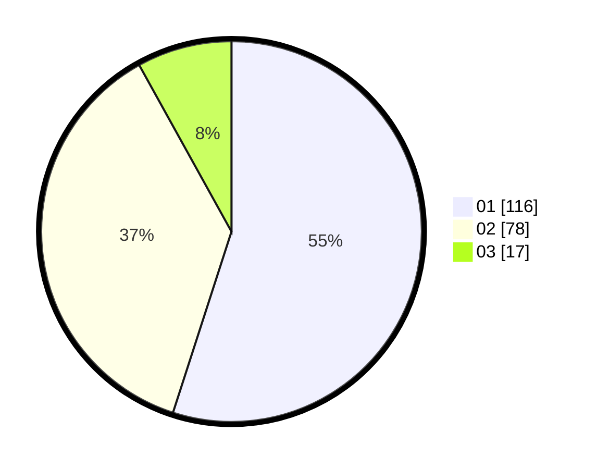

# Hasil

Hasil perolehan suara paslon dapat dilihat pada file paslon-01.txt, paslon-02.txt, dan paslon-03.txt.

Jika tidak ada, artinya data tersebut belum ada pada SIREKAP.

## Perolehan Suara

 * Paslon 01: **116**.
 * Paslon 02: **78**.
 * Paslon 03: **17**.

## Foto C Plano

https://sirekap-obj-formc.kpu.go.id/6db7/pemilu/ppwp/31/71/08/10/03/3171081003049-20240214-221226--8e47ed52-b078-467d-83c6-9fdb0f243df0.jpg

https://sirekap-obj-formc.kpu.go.id/6db7/pemilu/ppwp/31/71/08/10/03/3171081003049-20240214-191150--b7169882-2986-45dd-85eb-3036e48a885c.jpg

https://sirekap-obj-formc.kpu.go.id/6db7/pemilu/ppwp/31/71/08/10/03/3171081003049-20240214-190020--58431d3c-960a-4559-af8d-dbfa23a99ad5.jpg

## DATA PEMILIH TETAP

Jumlah pemilih dalam DPT: **259**.
 * L: **134**.
 * P: **125**.

## DATA PENGGUNA HAK PILIH

Jumlah pengguna hak pilih dalam DPT: **212**.
 * L: **104**.
 * P: **108**.

Jumlah pengguna hak pilih dalam DPTb: **0**.
 * L: **0**.
 * P: **0**.

Jumlah pengguna hak pilih dalam DPK: **2**.
 * L: **2**.
 * P: **0**.

Jumlah pengguna hak pilih: **214**.
 * L: **106**.
 * P: **108**.

## JUMLAH SUARA SAH DAN TIDAK SAH

JUMLAH SELURUH SUARA SAH: **211**.

JUMLAH SUARA TIDAK SAH: **3**.

JUMLAH SELURUH SUARA SAH DAN SUARA TIDAK SAH: **214**.
