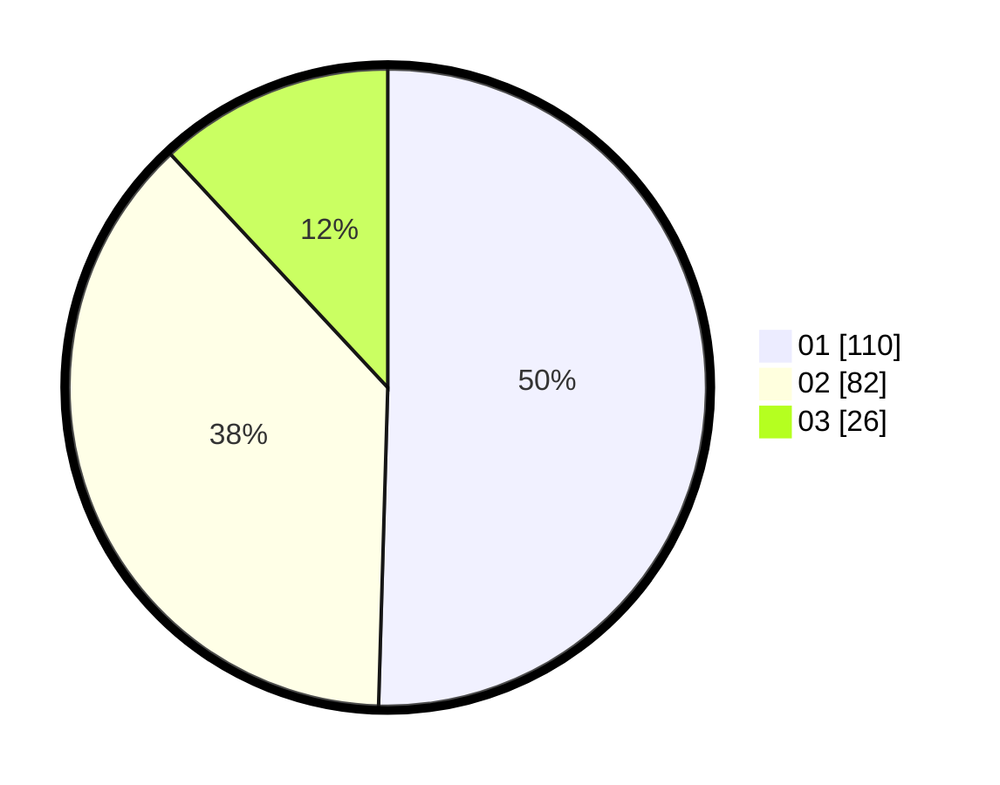

# Hasil

Hasil perolehan suara paslon dapat dilihat pada file paslon-01.txt, paslon-02.txt, dan paslon-03.txt.

Jika tidak ada, artinya data tersebut belum ada pada SIREKAP.

## Perolehan Suara

 * Paslon 01: **110**.
 * Paslon 02: **82**.
 * Paslon 03: **26**.

## Foto C Plano

https://sirekap-obj-formc.kpu.go.id/b6f7/pemilu/ppwp/31/71/08/10/03/3171081003051-20240214-185801--9eadef46-c532-453a-93ef-ce32d54ba99e.jpg

https://sirekap-obj-formc.kpu.go.id/b6f7/pemilu/ppwp/31/71/08/10/03/3171081003051-20240214-185848--46d7ef37-3ad1-45c0-a410-eea9a828fd86.jpg

https://sirekap-obj-formc.kpu.go.id/b6f7/pemilu/ppwp/31/71/08/10/03/3171081003051-20240214-185908--5669edc1-8a18-424c-bd86-22babfb4d014.jpg

## DATA PEMILIH TETAP

Jumlah pemilih dalam DPT: **265**.
 * L: **131**.
 * P: **134**.

## DATA PENGGUNA HAK PILIH

Jumlah pengguna hak pilih dalam DPT: **211**.
 * L: **100**.
 * P: **111**.

Jumlah pengguna hak pilih dalam DPTb: **10**.
 * L: **4**.
 * P: **6**.

Jumlah pengguna hak pilih dalam DPK: **0**.
 * L: **0**.
 * P: **0**.

Jumlah pengguna hak pilih: **221**.
 * L: **104**.
 * P: **117**.

## JUMLAH SUARA SAH DAN TIDAK SAH

JUMLAH SELURUH SUARA SAH: **218**.

JUMLAH SUARA TIDAK SAH: **3**.

JUMLAH SELURUH SUARA SAH DAN SUARA TIDAK SAH: **221**.
