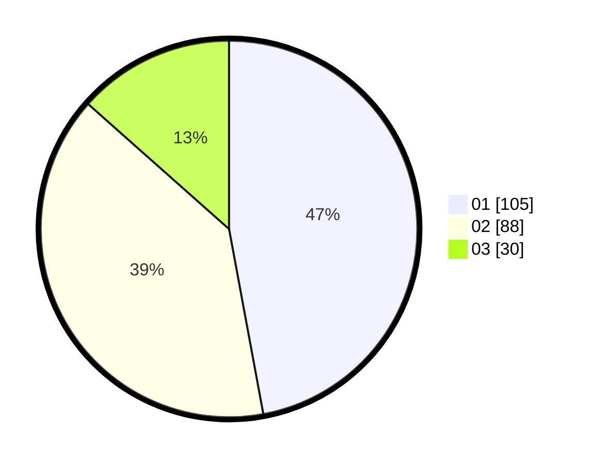

# Hasil

Hasil perolehan suara paslon dapat dilihat pada file paslon-01.txt, paslon-02.txt, dan paslon-03.txt.

Jika tidak ada, artinya data tersebut belum ada pada SIREKAP.

## Perolehan Suara

 * Paslon 01: **105**.
 * Paslon 02: **88**.
 * Paslon 03: **30**.

## Foto C Plano

https://sirekap-obj-formc.kpu.go.id/cfc1/pemilu/ppwp/31/71/08/10/03/3171081003053-20240214-202315--31da18ef-3e5b-4d2e-a782-4deae3ebb9ba.jpg

https://sirekap-obj-formc.kpu.go.id/cfc1/pemilu/ppwp/31/71/08/10/03/3171081003053-20240214-202437--66ab4814-64c1-4134-bdae-dc0a5cbc75d6.jpg

https://sirekap-obj-formc.kpu.go.id/cfc1/pemilu/ppwp/31/71/08/10/03/3171081003053-20240214-202609--e6e4cd2c-dcfa-4c6f-ab04-b7b2b74caffc.jpg
