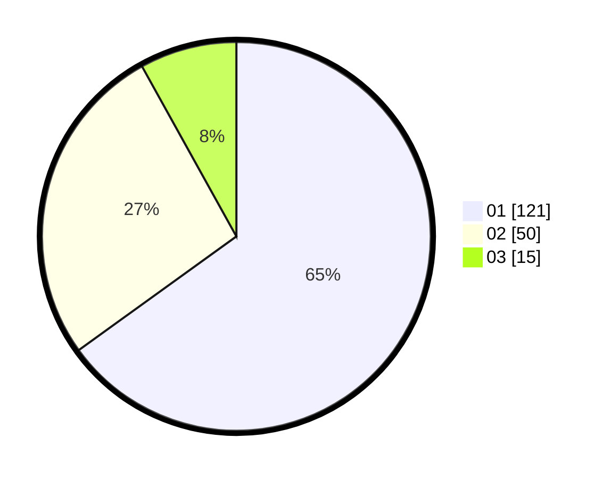

# Hasil

Hasil perolehan suara paslon dapat dilihat pada file paslon-01.txt, paslon-02.txt, dan paslon-03.txt.

Jika tidak ada, artinya data tersebut belum ada pada SIREKAP.

## Perolehan Suara

 * Paslon 01: **121**.
 * Paslon 02: **50**.
 * Paslon 03: **15**.

## Foto C Plano

https://sirekap-obj-formc.kpu.go.id/6602/pemilu/ppwp/31/71/08/10/03/3171081003055-20240215-020501--f607e901-bc4d-4ef9-b79c-92cfb4798aee.jpg

https://sirekap-obj-formc.kpu.go.id/6602/pemilu/ppwp/31/71/08/10/03/3171081003055-20240215-011841--1c3a16f7-d64e-4505-8fd0-6fc15bd87741.jpg

https://sirekap-obj-formc.kpu.go.id/6602/pemilu/ppwp/31/71/08/10/03/3171081003055-20240215-012542--eeb167c1-c141-48a0-8e29-50339682f39a.jpg
