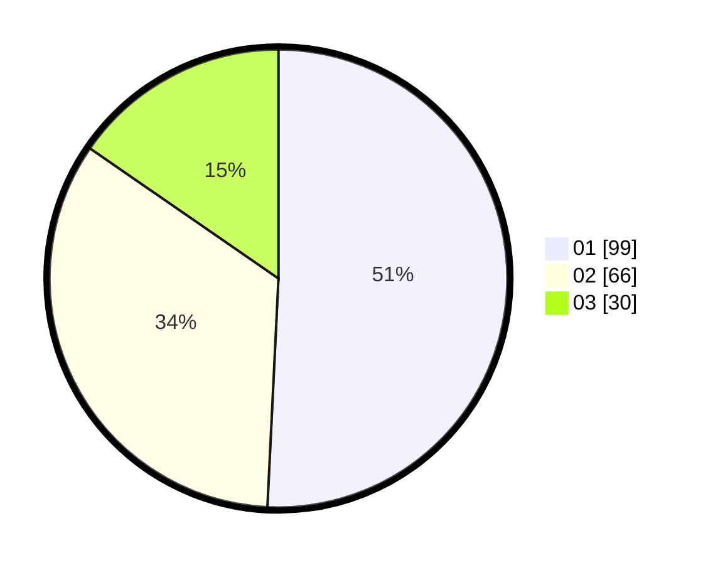

# Hasil

Hasil perolehan suara paslon dapat dilihat pada file paslon-01.txt, paslon-02.txt, dan paslon-03.txt.

Jika tidak ada, artinya data tersebut belum ada pada SIREKAP.

## Perolehan Suara

 * Paslon 01: **99**.
 * Paslon 02: **66**.
 * Paslon 03: **30**.

## Foto C Plano

https://sirekap-obj-formc.kpu.go.id/09e1/pemilu/ppwp/31/71/08/10/03/3171081003061-20240214-215738--f2ca3855-f41a-41ef-b961-1303cdaea5a0.jpg

https://sirekap-obj-formc.kpu.go.id/09e1/pemilu/ppwp/31/71/08/10/03/3171081003061-20240214-215933--96269ec1-2f21-4237-b35a-11f21707db3c.jpg

https://sirekap-obj-formc.kpu.go.id/09e1/pemilu/ppwp/31/71/08/10/03/3171081003061-20240214-220105--0c273a16-b975-4f09-81ba-e2da7e4c888e.jpg

## DATA PEMILIH TETAP

Jumlah pemilih dalam DPT: **264**.
 * L: **133**.
 * P: **131**.

## DATA PENGGUNA HAK PILIH

Jumlah pengguna hak pilih dalam DPT: **196**.
 * L: **98**.
 * P: **98**.

Jumlah pengguna hak pilih dalam DPTb: **1**.
 * L: **0**.
 * P: **1**.

Jumlah pengguna hak pilih dalam DPK: **2**.
 * L: **1**.
 * P: **1**.

Jumlah pengguna hak pilih: **199**.
 * L: **99**.
 * P: **100**.

## JUMLAH SUARA SAH DAN TIDAK SAH

JUMLAH SELURUH SUARA SAH: **195**.

JUMLAH SUARA TIDAK SAH: **4**.

JUMLAH SELURUH SUARA SAH DAN SUARA TIDAK SAH: **199**.
