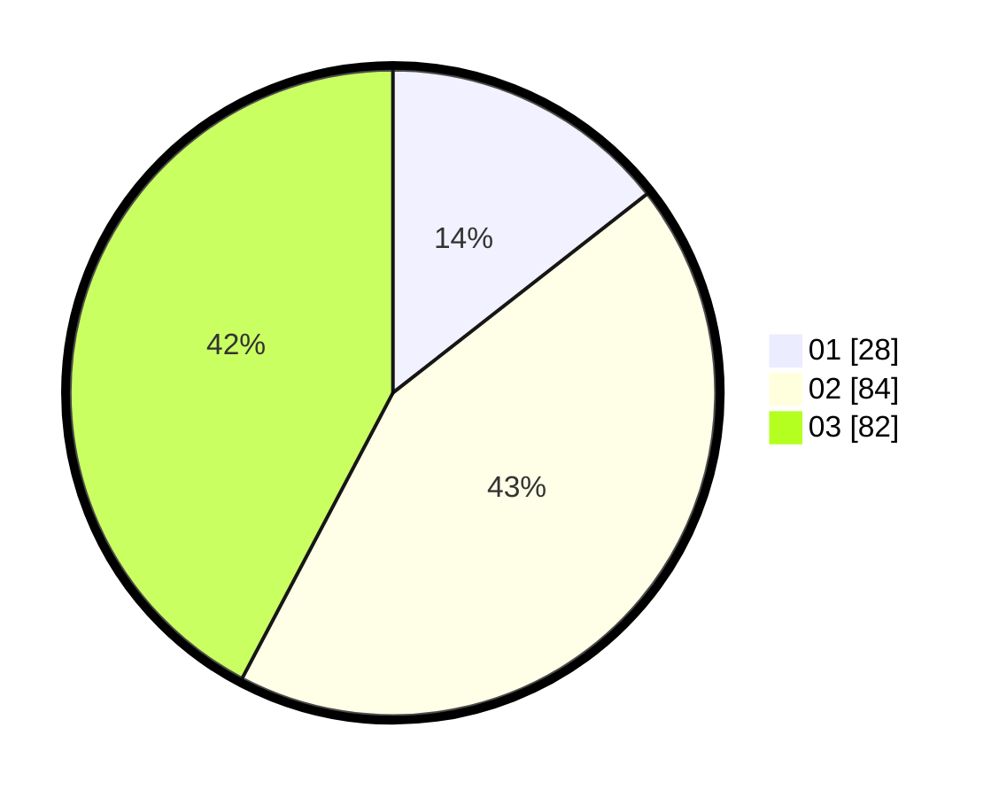

# Hasil

Hasil perolehan suara paslon dapat dilihat pada file paslon-01.txt, paslon-02.txt, dan paslon-03.txt.

Jika tidak ada, artinya data tersebut belum ada pada SIREKAP.

## Perolehan Suara

 * Paslon 01: **28**.
 * Paslon 02: **84**.
 * Paslon 03: **82**.

## Foto C Plano

https://sirekap-obj-formc.kpu.go.id/9b44/pemilu/ppwp/31/71/08/10/04/3171081004003-20240214-211117--4b6a2510-ad35-4c99-bbe9-09bdbb97ca49.jpg
